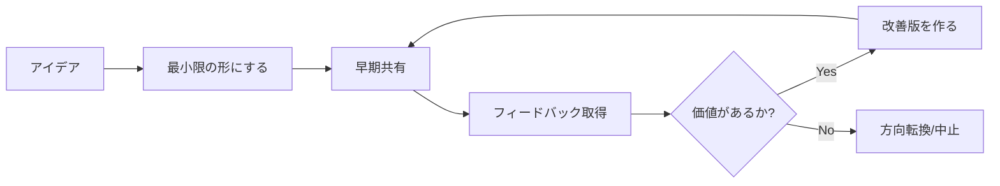

```markdown
---
title: "「完璧主義」をやめて「最善主義」に切り替えた話 - 生産性が3倍になった思考法"
emoji: "🎯"
type: "idea"
topics: ["マインドセット", "生産性", "キャリア", "メンタルヘルス", "働き方"]
published: true
---

## はじめに - あなたは「完璧」を目指して疲弊していませんか?

この記事は、完璧主義に悩むすべての人に向けて書いています。

私自身、長年「完璧でなければ意味がない」という思考に囚われ、プロジェクトを完成させられない、常に不安を抱える、そして慢性的な疲労に悩まされていました。しかし、**「最善主義」という考え方にシフト**してから、生産性が劇的に向上し、メンタルヘルスも大幅に改善しました。

この記事では、完璧主義と最善主義の違い、具体的な切り替え方法、そして実際に私が実践して効果があったテクニックを共有します。

**この記事を読むとわかること:**
- 完璧主義がもたらす3つの落とし穴
- 最善主義への具体的な切り替え方法
- 今日から使える5つの実践テクニック
- 完璧主義から脱却した先にある世界

## 完璧主義の3つの落とし穴

### 1. 永遠に完成しない「完璧」を追い求める

完璧主義者の最大の問題は、**「完璧」の基準が常に更新され続ける**ことです。

例えば、こんな経験はありませんか?

- ブログ記事を書いているが、「もっと良い表現があるはず」と何度も書き直し、結局公開できない
- プレゼン資料を作っているが、「もう1つデータを追加したら...」と際限なく作業を続ける
- コードのリファクタリングに時間をかけすぎて、新機能の開発が進まない

```javascript
// 完璧主義者のコード進化の例
// v1: 動作する最小限のコード
function calculateTotal(items) {
  return items.reduce((sum, item) => sum + item.price, 0);
}

// v2: 「もっと良くできるはず...」
function calculateTotal(items) {
  if (!Array.isArray(items)) throw new Error('Invalid input');
  return items.reduce((sum, item) => {
    if (typeof item.price !== 'number') throw new Error('Invalid price');
    return sum + item.price;
  }, 0);
}

// v3: 「さらに完璧に...」(そして永遠に続く)
class Calculator {
  constructor(validationStrategy, loggingService, errorHandler) {
    // ... 結局本質的な価値は v1 と変わらないのに複雑さだけが増す
  }
}
```

**問題の本質**: 完璧を追求するあまり、「価値の提供」というゴールから遠ざかってしまうのです。

### 2. 行動を妨げる「失敗への恐怖」

完璧主義は、失敗を許容できない思考パターンと密接に結びついています。

- 「100点でなければ0点と同じ」という極端な思考
- 「失敗したら評価が下がる」という恐怖
- 「中途半端なものは出せない」というプライド

結果として:
- 新しいことにチャレンジできない
- フィードバックを求めるタイミングが遅れる
- 小さく試して改善する機会を失う

### 3. 慢性的なストレスと燃え尽き

完璧主義は、メンタルヘルスに深刻な影響を与えます。

**私自身の経験:**
- 常に「まだ足りない」という焦燥感
- 達成しても「もっとできたはず」という後悔
- 睡眠の質の低下と慢性的な疲労
- 趣味やリラックスする時間への罪悪感

WHO(世界保健機関)の調査でも、完璧主義傾向とバーンアウト(燃え尽き症候群)の強い相関が報告されています。

## 「最善主義」とは何か - 新しい思考のフレームワーク

### 最善主義の定義

**最善主義 = 現在の制約条件の中で、最も価値を生み出す選択をする思考法**

重要なポイントは以下の3つです:

1. **「制約条件」を認める**: 時間、リソース、情報、スキルには限界がある
2. **「価値」を中心に考える**: 完璧さではなく、届ける価値を最大化する
3. **「選択」を意識する**: トレードオフを理解し、意識的に決断する

### 完璧主義 vs 最善主義の比較表

| 観点 | 完璧主義 | 最善主義 |
|------|---------|---------|
| ゴール設定 | 「完璧」(抽象的・無限) | 「価値の最大化」(具体的・有限) |
| 失敗の捉え方 | 「避けるべき恥」 | 「学びの機会」 |
| 判断基準 | 「まだ足りない」 | 「これで十分か?」 |
| プロセス | 完成してから公開 | 早く出してフィードバック |
| 時間感覚 | 際限なく時間をかける | 期限を設けて最善を尽くす |
| ストレス | 常に不安と焦燥感 | 適度な緊張感と達成感 |

## 最善主義への具体的な切り替え方法

### ステップ1: 自分の完璧主義パターンを認識する

まず、自分がどんな場面で完璧主義に陥るかを観察しましょう。

**セルフチェックリスト:**
```
□ 「もう少し」が口癖になっている
□ 締め切りギリギリまで手を入れ続ける
□ 他人に見せる前に何度も確認する
□ 小さなミスを過度に気にする
□ 「完璧でないなら意味がない」と思う
□ 他人の評価を極端に気にする
```

3つ以上当てはまる場合、完璧主義の傾向があります。

### ステップ2: 「価値」を明確に定義する

完璧さではなく、**何のために、誰のために、どんな価値を届けるのか**を明確にします。

**実践ワークシート:**

```markdown
# プロジェクト/タスク名: _________________

## 誰のため?(ターゲット)
- 

## どんな問題を解決する?(課題)
- 

## 最も重要な価値は?(本質)
- 

## 最小限で届けられる形は?(MVP)
- 

## いつまでに届ける?(期限)
- 
```

### ステップ3: 「80%ルール」を採用する

パレートの法則(80:20の法則)を応用し、**80%の完成度で一旦区切る**習慣をつけます。

**実践例:**

```javascript
// タスク管理における80%ルールの実装例
class Task {
  constructor(name, estimatedTime) {
    this.name = name;
    this.estimatedTime = estimatedTime;
    this.timeSpent = 0;
  }
  
  is80PercentDone() {
    // 見積もり時間の80%を超えたらアラート
    return this.timeSpent >= this.estimatedTime * 0.8;
  }
  
  checkProgress() {
    if (this.is80PercentDone()) {
      console.log(`⚠️ "${this.name}" は80%ラインです。`);
      console.log('今の状態で価値を届けられないか検討しましょう');
    }
  }
}
```

**実際の行動:**
1. 見積もり時間の80%が経過したら、必ず立ち止まる
2. 「今の状態で価値を届けられないか?」を自問する
3. 残り20%で「完璧」を目指すより、フィードバックを得る

### ステップ4: 「バージョニング思考」を導入する

ソフトウェア開発のバージョン管理の考え方を、あらゆるタスクに適用します。

**v1.0思考のメリット:**

```
❌ 完璧主義: 「完璧な1.0を作ってから公開」
✅ 最善主義: 「動くv1.0を出して、v1.1, v1.2...と改善」

具体例:
- ブログ記事: v1.0で公開 → 読者の反応でv1.1に更新
- プレゼン資料: v1.0で共有 → フィードバックでv2.0を作成
- 新機能開発: v1.0でリリース → ユーザーの声でv2.0を設計
```

**実践テクニック:**
- ファイル名やドキュメントに明示的にバージョン番号をつける
- 「v1.0のゴール」を事前に定義し、それ以上は次バージョンに回す
- 改善点をバックログとして記録し、「v2.0でやること」リストを作る

### ステップ5: フィードバックループを早期に組み込む

完璧を目指して時間をかけるより、**早くフィードバックを得て軌道修正**する方が効率的です。

**フィードバックループの設計:**



**具体的な行動例:**
- **記事執筆**: 完成前に目次だけをSNSで共有し、反応を見る
- **開発**: 完全に作り込む前にプロトタイプを関係者に見せる
- **企画**: 詳細なドキュメント前に1枚のスライドで提案する

## 今日から使える5つの実践テクニック

### テクニック1: タイムボックス法

**やり方:**
各タスクに固定の時間枠を設定し、その中で最善を尽くす。

```
例: ブログ記事執筆
- アウトライン作成: 30分
- 初稿執筆: 90分
- 見直し: 30分
- 合計: 2.5時間で区切る
```

**ポイント:** タイマーを使い、時間が来たら強制的に終了。「まだできる」と思っても次に進む。

### テクニック2: デイリー「Done is better than perfect」宣言

毎朝、その日のタスクについて「完璧でなくても完了させるもの」を1つ宣言します。

**実践フォーマット:**
```
今日の「Done > Perfect」タスク:
[ タスク名 ]

完璧な状態: _______________
今日届ける状態: _______________

理由: _______________
```

### テクニック3: 「恐怖日記」をつける

完璧主義の根底にある恐怖を可視化します。

**記録する内容:**
- 何を恐れているか?(失敗、批判、評価の低下など)
- その恐怖は現実的か?
- 最悪の場合、実際に何が起こるか?
- それは本当に人生に致命的か?

**効果:** 恐怖を言語化することで、それが過大評価されていることに気づけます。

### テクニック4: 「Good Enough」基準シートを作る

プロジェクトごとに「これで十分」の基準を事前に明文化します。

```markdown
# [プロジェクト名] の "Good Enough" 基準

## 必須要件(これがないとNG)
- [ ] 
- [ ] 

## 十分要件(これがあればOK)
- [ ] 
- [ ] 

## 理想要件(時間があれば)
- [ ] 
- [ ] 

→ 「十分要件」を満たしたら次に進む
```

### テクニック5: リフレクション習慣

週に1回、「最善主義で成功した瞬間」を振り返ります。

**リフレクション質問:**
1. 今週、80%で区切って良かったことは?
2. 早期フィードバックで助かったことは?
3. 完璧を目指さなかったことで得られた時間は何に使えた?
4. 次週、最善主義で取り組みたいタスクは?

## 最善主義に切り替えて得られた3つの変化

### 変化1: 生産性の劇的向上

**Before(完璧主義時代):**
- ブログ記事: 1本に2週間
- 機能開発: 1機能に1ヶ月
- プレゼン資料: 3日かけても満足できない

**After(最善主義採