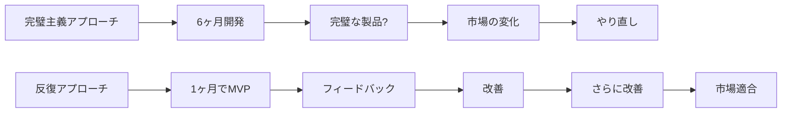

```markdown
---
title: "「完璧主義」を捨てたら、むしろ成果が出た話 - 実践的な思考転換のステップ"
emoji: "🌱"
type: "idea"
topics: ["思考法", "生産性", "マインドセット", "メンタルヘルス", "キャリア"]
published: true
---

## はじめに:完璧主義という罠

エンジニアやクリエイターとして働く中で、「もっと完璧にしなければ」「まだこれでは不十分だ」と感じて、結局リリースできずに終わってしまった経験はありませんか?

私自身、長年「完璧でなければ意味がない」という思考に囚われ、多くのプロジェクトを途中で止めてしまいました。しかし、ある転換点を経て「完璧主義を捨てる」決断をしたところ、驚くほど成果が出るようになりました。

**この記事で得られること:**
- 完璧主義がもたらす3つの弊害の理解
- 「Done is better than perfect」を実践する具体的ステップ
- 実際に使える思考転換のフレームワーク
- 完璧主義を手放しても品質を保つ方法

完璧を目指すことと、完璧主義に囚われることは全く別物です。この違いを理解し、実践的な思考転換を行うことで、あなたの創造性と生産性は飛躍的に向上するでしょう。

## 完璧主義がもたらす3つの深刻な弊害

### 1. 分析麻痺(Analysis Paralysis)による行動停止

完璧主義者は「完璧な計画」を立てようとするあまり、実際の行動に移れません。

**典型的な症状:**
```
プロジェクト開始前の思考パターン:
1. 「まず完璧な設計書を作らないと...」
2. 「もっと良い技術スタックがあるかもしれない...」
3. 「全ての edge case を考慮しなければ...」
4. 「もう少し調べてから始めよう...」
→ 結果:永遠に始まらない
```

心理学の研究によれば、完璧を求めるあまり行動を起こせない状態は、実際の能力低下よりも大きな損失をもたらします。**行動しないことのコストは、不完全な行動のコストを常に上回る**のです。

### 2. 燃え尽き症候群(Burnout)への直行ルート

完璧を目指し続けることは、終わりのないマラソンを全力疾走で走り続けるようなものです。

私が経験した完璧主義による燃え尽きのサイクル:
1. 高い理想を設定する
2. 現実とのギャップに焦燥感を覚える
3. より長時間働いて埋め合わせようとする
4. 疲弊するが「まだ足りない」と感じる
5. パフォーマンスが低下する
6. さらに焦りが増す → 1に戻る

このサイクルから抜け出せずに、最終的にプロジェクトへの情熱を完全に失ってしまいました。

### 3. 機会損失とフィードバックループの欠如

完璧なものを作ろうとして時間をかけすぎると、以下の重大な機会を失います:

**失われるもの:**
- 早期のユーザーフィードバック
- 市場参入のタイミング
- 反復改善の機会
- 学習と成長のサイクル



## 私が完璧主義を手放した転換点

### きっかけ:半年かけたプロジェクトのお蔵入り

3年前、私は「完璧な個人開発プロジェクト」に取り組んでいました。設計、コード品質、テストカバレッジ、ドキュメント...すべてにこだわり、半年間をかけました。

しかし、いざリリースしようとしたとき、気づいたのです:
- **誰もそのレベルの完璧さを求めていなかった**
- 半年の間に技術トレンドが変わっていた
- 自分自身がプロジェクトに飽きていた

その日、私は決断しました。「もう完璧を目指すのはやめよう」と。

### 実践した3つの具体的な変化

#### 変化1:「70%ルール」の導入

```
完璧主義時代:100%を目指して50%で終わる
新しい思考:70%で完成として出し、フィードバックで100%に近づける

実際の行動:
- 機能は主要な3つに絞る(当初10個計画していた)
- テストは critical path のみ
- ドキュメントは README と基本的な使い方のみ
- デザインは既存のUIライブラリを活用

結果:2週間でリリース → 3ヶ月で実際に使われる製品に成長
```

#### 変化2:「タイムボックス」の厳格な適用

各タスクに明確な時間制限を設けました:

```markdown
## 以前のタスク管理
- [ ] 完璧なAPI設計を考える

## 新しいタスク管理
- [ ] API設計を考える [2時間]
  - 1時間目:主要エンドポイント3つを決定
  - 2時間目:リクエスト/レスポンス形式を定義
  - それ以上は進めない、後で改善
```

この方法で、**決断疲れを大幅に減らす**ことができました。

#### 変化3:「公開駆動開発(Publication-Driven Development)」

```javascript
// 以前の私の開発フロー
function develop() {
  while (product !== perfect) {
    improve();
    refactor();
    reconsider();
  }
  // ここに到達することはない
}

// 新しい開発フロー
function develop() {
  const deadline = Date.now() + TWO_WEEKS;
  
  while (Date.now() < deadline) {
    implementCore();
  }
  
  publish(); // 必ず実行される!
  
  while (true) {
    const feedback = getUserFeedback();
    improve(feedback);
    publish();
  }
}
```

最初から「2週間後に必ず公開する」と決めることで、重要なものに集中できるようになりました。

## 実践的フレームワーク:完璧主義を手放す5ステップ

### Step 1:「十分である(Good Enough)」の基準を明確化する

プロジェクト開始前に、**最小限の成功基準**を定義します。

```markdown
## プロジェクト:新しい技術ブログ

### ❌ 曖昧な目標
「素晴らしいブログを作る」

### ✅ 明確な"Good Enough"基準
1. 記事が読める(最低限のレイアウト)
2. 週1回更新できる仕組み
3. SNSでシェアできる
4. レスポンシブ対応(スマホで読める)

それ以外(アニメーション、完璧なSEO、オリジナルデザインetc.)は
「あったら良い」であり「必須ではない」
```

### Step 2:「パーキンソンの法則」を逆手に取る

> 仕事の量は、完成のために与えられた時間をすべて満たすまで膨張する
> — パーキンソンの法則

この法則を**意図的に活用**します:

```
実践例:技術記事執筆

制約なし → 1記事に1週間かけて完璧を目指す → 月4記事
        → 疲弊して続かない

意図的な制約 → 1記事2時間と決める → 週2記事 → 月8記事
             → 継続可能で成長も実感
```

私は現在、ブログ記事を「90分タイマー」で書いています。最初は不完全に感じましたが、読者からの反応は以前より良好です。

### Step 3:「バージョニング思考」を取り入れる

ソフトウェアのバージョン管理の考え方を、すべてのクリエイティブ活動に適用します。

```
v0.1: 最小限のアイデアの形(1時間で作成)
v0.5: 人に見せられる状態(1日で作成)
v1.0: 公開可能な状態(1週間で作成) ← ここで必ずリリース
v1.1: フィードバック反映(随時更新)
v2.0: 大幅改善(必要に応じて)
```

**重要なのは、v1.0を実際にリリースすること**です。多くの完璧主義者は、永遠にv0.9で止まってしまいます。

### Step 4:「フィードバック・ファースト」の実践

実際のユーザーからのフィードバックは、あなたの想像の100倍価値があります。

```python
# 完璧主義者の思考プロセス
def create_product():
    imagine_all_users()  # 6ヶ月
    build_for_imaginary_users()  # 6ヶ月
    launch()  # 想定と現実のギャップに愕然とする
    
# 新しい思考プロセス
def create_product():
    build_minimum()  # 2週間
    launch()
    for user in real_users:
        feedback = user.use_and_comment()
        improve(feedback)  # 実際のニーズに基づいた改善
```

実践ポイント:
- 最初の5人のユーザーからのフィードバックで方向性を決める
- 「自分の想像」より「1人の実際の声」を優先する
- 完璧な状態で100人に届けるより、70%の状態で1000人に届ける

### Step 5:「プログレス・ジャーナル」で小さな進歩を可視化

完璧主義者は、達成したことよりも「まだ足りないこと」に目が向きがちです。これを改善するために:

```markdown
## 2024年3月の進捗ジャーナル

### Week 1
✅ プロジェクトのコア機能を実装(70%完成)
✅ 3人の友人にテストしてもらった
✅ 重要なバグを2つ修正

### Week 2
✅ ランディングページ公開(完璧ではないが機能する)
✅ Twitter で初めてシェア → 12いいね、2コメント
✅ 1件の貴重なフィードバックを実装に反映

### 気づき
完璧を目指していたら、この2週間で何も達成できなかった。
70%で公開したことで、実際のユーザーと対話が始まった。
```

**毎週、達成したことを記録する**習慣をつけることで、「進んでいる」実感を持続できます。

## 品質を犠牲にしない:完璧主義と妥協の違い

ここで重要な区別をする必要があります:**完璧主義を手放すことは、品質を犠牲にすることではありません**。

### 質を保つための3つの原則

#### 原則1:「コアバリュー」は妥協しない

```
例:ウェブアプリケーション開発

妥協してはいけないコア:
- セキュリティ(ユーザーデータの保護)
- 主要機能の動作
- 基本的なユーザビリティ

妥協できる部分:
- アニメーション効果
- 管理画面の見た目
- 詳細な分析機能
- エッジケースへの対応
```

#### 原則2:「技術的負債」を意識的に管理する

```javascript
// ❌ 悪い妥協:後で痛い目に遭う
function processData(data) {
  // とりあえず動けばいい...
  eval(data); // セキュリティリスク!
}

// ✅ 良い妥協:意図的で計画的
function processData(data) {
  // TODO: v1.1でより効率的なアルゴリズムに置き換え
  // 現在はシンプルな実装で動作を確認
  return data.map(item => simpleProcess(item));
}
```

意識的に「後で改善する」と決めた部分は、TODOコメントとIssueで管理します。

#### 原則3:「反復的品質向上」を信じる

```
完璧主義アプローチ:
リリース前に品質100%を目指す → 永遠にリリースされない

反復アプローチ:
v1.0: 品質70% でリリース
v1