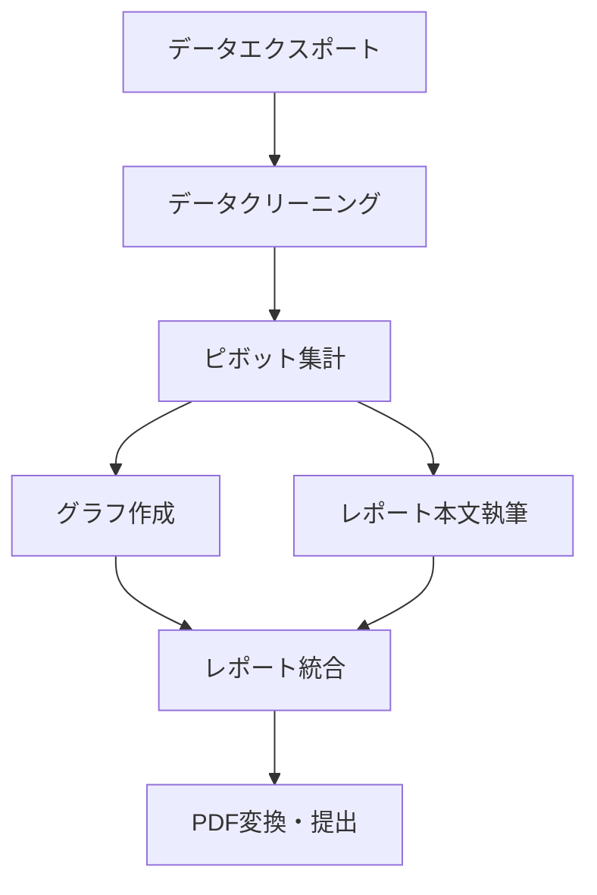

## はじめに：なぜタスク分解が仕事効率化の鍵なのか

「やることが多すぎて何から手をつければいいかわからない」
「大きなプロジェクトを前にして、つい先延ばしにしてしまう」

このような悩みを抱えていませんか? 実は、これらの問題の根本原因は**タスクの粒度が大きすぎること**にあります。

本記事では、私が5年間実践してきた「タスク分解フレームワーク」を紹介します。このフレームワークを使うことで、以下のような効果が期待できます：

- ✅ 大きなタスクへの心理的ハードルが下がる
- ✅ 作業の見積もり精度が向上する
- ✅ 進捗が可視化され、モチベーションが維持できる
- ✅ チーム内での認識のズレが減少する

それでは、具体的な方法を見ていきましょう。

## タスク分解の基本原則：「2時間ルール」

タスク分解の最も重要な原則は、**すべてのタスクを2時間以内で完了できる単位に分割する**ことです。

### なぜ2時間なのか？

人間の集中力は一般的に90〜120分が限界とされています（ウルトラディアンリズム）。2時間という単位は、以下の理由で最適です：

1. **1回の集中セッションで完了できる**：達成感を得やすい
2. **見積もりしやすい**：「午前中に終わる」「昼休憩前に終わる」など具体的にイメージできる
3. **計画が立てやすい**：1日4タスクなど、現実的なスケジューリングが可能

### 悪い例と良い例

**❌ 悪い例：粒度が大きすぎるタスク**
```
- 新機能を実装する（10時間）
- レポートを作成する（5時間）
- クライアントへの提案資料を準備する（8時間）
```

**✅ 良い例：2時間以内に分解されたタスク**
```
新機能の実装（全体で10時間）
├─ データベース設計書を作成する（1.5時間）
├─ APIエンドポイントを実装する（2時間）
├─ フロントエンド画面を作成する（2時間）
├─ バリデーションロジックを追加する（1.5時間）
├─ ユニットテストを書く（2時間）
└─ 動作確認とバグ修正（1時間）
```

## 実践：5ステップのタスク分解フレームワーク

### Step 1：ゴールを明確にする

まず、最終的に達成したい状態を具体的に定義します。

**フォーマット：**
```
[主語]が[どのような状態]になっている
```

**例：**
- ❌ 「レポートを書く」（曖昧）
- ✅ 「四半期の売上分析レポートがPDF化され、部長に提出されている」（具体的）

### Step 2：必要な成果物をリストアップする

ゴール達成に必要な「目に見える成果物」を洗い出します。

**例：四半期レポートの場合**
- データ集計用のExcelファイル
- グラフと図表
- レポート本文（Word）
- 表紙とサマリーページ
- PDF変換された最終版

### Step 3：各成果物を作るプロセスを分解する

それぞれの成果物を作るために必要な作業を書き出します。

**例：データ集計用Excelファイルの場合**
```
1. 売上データをシステムからエクスポートする（0.5時間）
2. データをクリーニングする（1時間）
3. ピボットテーブルで集計する（1時間）
4. 前期比較用の計算式を追加する（0.5時間）
```

### Step 4：依存関係を整理する

タスク同士の順序関係を明確にします。



### Step 5：各タスクに時間を見積もる

最後に、各タスクの所要時間を見積もります。

**見積もりのコツ：**
- 過去の類似タスクを参考にする
- 初めての作業は、予想時間の1.5倍を見積もる
- 割り込み作業を考慮して、バッファを20%確保する

## 実践例：ブログ記事執筆のタスク分解

実際に私がこの記事を書く際に行ったタスク分解を公開します。

### 元のタスク
```
「仕事効率化に関するZenn記事を書く」（推定5時間）
```

### 分解後
```markdown
## フェーズ1：企画・設計（2時間）
- [ ] ターゲット読者を定義する（0.5時間）
- [ ] 記事のゴールを設定する（0.5時間）
- [ ] 見出し構成を作る（1時間）

## フェーズ2：執筆（2.5時間）
- [ ] 導入部分を書く（0.5時間）
- [ ] 各セクションの本文を書く（1.5時間）
- [ ] 具体例を追加する（0.5時間）

## フェーズ3：仕上げ（1時間）
- [ ] 文章を推敲する（0.5時間）
- [ ] frontmatterを設定する（0.2時間）
- [ ] プレビューで確認・修正（0.3時間）
```

このように分解することで、「今日は企画だけ終わらせよう」「空き時間30分で導入部分だけ書こう」といった柔軟な作業が可能になります。

## ツールの活用：デジタル×アナログのハイブリッド管理

タスク分解したリストを効率的に管理するためのツール戦略を紹介します。

### おすすめツール構成

**1. デイリータスク管理：Todoist（デジタル）**
- 2時間以内のタスクを管理
- 優先度とラベルで分類
- 繰り返しタスクの自動生成

**設定例：**
```
タスク: データベース設計書を作成する
プロジェクト: 新機能開発
優先度: P1
ラベル: #開発 #集中作業
期限: 今日 10:00-12:00
```

**2. プロジェクト全体管理：Notion（デジタル）**
- タスク分解の全体像を保存
- 依存関係を可視化
- ドキュメントと連携

**3. 当日のフォーカス：紙のメモ（アナログ）**
- その日の3〜5タスクだけを手書き
- 完了したらチェックマークで達成感
- デジタル疲れを防ぐ

### 私の1日の流れ

```
8:30  Notionでプロジェクト全体を確認
8:40  Todoistから今日やるべきタスクを抽出
8:45  紙のメモに今日のトップ3タスクを書く
9:00  ポモドーロタイマーをセットして作業開始
      ↓
17:00 Todoistで完了タスクをチェック
17:10 Notionでプロジェクト進捗を更新
17:15 明日のタスクを仮選定
```

## よくある失敗パターンと対処法

### 失敗1：分解しすぎて管理コストが増える

**症状：**
タスクが30個も40個も並び、更新するだけで疲れる

**対処法：**
- 「今週やること」レベルまでは詳細化し、来週以降は粗いままでOK
- 定期的にタスクリストを見直し、統合する

### 失敗2：完璧主義で分解が終わらない

**症状：**
タスク分解に時間をかけすぎて、実作業に入れない

**対処法：**
- タスク分解自体も「30分」など時間制限を設ける
- 70%の精度で良しとし、作業しながら調整する
- 「とりあえずバージョン」をすぐ作る

### 失敗3：分解したタスクが実行されない

**症状：**
綺麗にタスクを分解したのに、なぜか進まない

**対処法：**
- タスクに「動詞」が含まれているか確認する
  - ❌ 「データベース」→ ✅ 「データベース設計書を書く」
- 最初のアクションを明確にする
  - 「〇〇を開く」「〇〇にログインする」など
- タスクの開始時刻をカレンダーに入れる

## チームでのタスク分解：認識合わせのコツ

個人だけでなく、チームでタスク分解を共有することで、プロジェクトの成功率が劇的に上がります。

### チーム分解のルール

1. **共通言語を定義する**
   - 「タスク」「サブタスク」「チケット」など用語を統一
   - 「2時間ルール」をチーム内で合意

2. **分解粒度のサンプルを共有する**
   - 良い例・悪い例をドキュメント化
   - 新メンバーのオンボーディングで説明

3. **週次でタスクレビューを行う**
   - 粒度が適切か、チームで確認
   - 見積もりと実績のギャップを分析

### チーム分解会議のアジェンダ（30分）

```
1. 今週のゴール確認（5分）
2. 必要な成果物のリストアップ（10分）
3. 各成果物のタスク分解（10分）
4. 担当者アサインと時間見積もり（5分）
```

## まとめ：今日から始められるアクション

タスク分解は、一見面倒に見えますが、実践すれば確実に仕事のスピードと質が向上します。

### 今日から始める3ステップ

**ステップ1：今抱えている「大きなタスク」を1つ選ぶ**
まずは1つのタスクで試してみましょう。

**ステップ2：2時間以内の単位に分解してみる**
この記事のフレームワークを使って、実際に分解してください。

**ステップ3：分解したタスクを1つだけ実行する**
完璧を目指さず、まず1つのタスクを完了させて達成感を味わいましょう。

### 継続のためのヒント

- **週に1回、15分だけ「タスク分解タイム」を設ける**
- **完了したタスクを記録し、自分の成長を可視化する**
- **チームメンバーと分解のコツを共有し合う**

タスク分解は、筋トレと同じで継続することで効果が実感できます。最初は時間がかかるかもしれませんが、慣れてくると5分程度で的確な分解ができるようになります。

あなたの仕事効率化の第一歩として、ぜひこのフレームワークを活用してください！

---

**この記事が役に立ったら、ぜひ「いいね」やコメントで教えてください！**
あなたのタスク分解のコツや、実践してみた感想もお待ちしています 🚀