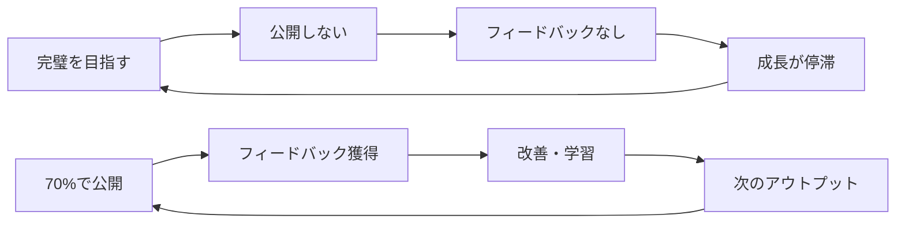

## はじめに：完璧主義という名の呪縛

エンジニアやクリエイターの多くが抱える悩み、それが「完璧主義」です。

- コードを公開する前に何度も見直してしまう
- ブログ記事の下書きが溜まる一方で公開できない
- 「もっと良いものができるはず」と永遠にリファクタリングを続ける

私自身、長年この完璧主義に苦しめられてきました。しかし、あるきっかけで「完璧主義を手放す」マインドセットにシフトしたところ、アウトプットの量が劇的に増え、結果として質も向上するという好循環が生まれました。

この記事では、完璧主義を手放すための具体的な思考法と実践方法を、実体験を交えてお伝えします。

## 完璧主義がもたらす3つの弊害

### 1. アウトプットの機会損失

完璧を求めるあまり、世に出すタイミングを逃してしまうケースは非常に多いです。

**具体例：**
- 技術ブログの下書きが50記事溜まっているが、公開記事は5つだけ
- OSSへのPRを出そうと思いながら、コードの完成度を気にして半年経過
- 社内勉強会の発表資料を作り込みすぎて、結局申し込み期限を過ぎる

これらは全て、**「完璧でないものを出すのが怖い」という心理**が根底にあります。

### 2. 学習機会の喪失

完璧主義者は、フィードバックを得る前に自己完結しようとします。しかし、**本当の学びは他者からのフィードバックによってもたらされる**ことが多いのです。



### 3. 精神的な疲弊

「完璧でなければならない」というプレッシャーは、創造性を奪い、燃え尽き症候群の原因にもなります。

私自身、かつては：
- 深夜2時まで「完璧な」プルリクエストを作成
- 週末もコードレビューの指摘が気になって休めない
- 小さなバグでも自己嫌悪に陥る

このような状態が続き、最終的には開発そのものが楽しくなくなっていました。

## 転機：「Done is better than perfect」との出会い

転機となったのは、Meta（旧Facebook）の有名なモットー「**Done is better than perfect**（完璧を目指すよりまず終わらせろ）」を知ったことでした。

当初は「雑な仕事を推奨しているのでは?」と疑問に思いましたが、その真意は：

> 完璧を待つより、動くものを早く出して改善サイクルを回す方が、最終的に良いプロダクトができる

ということだと理解しました。

## 完璧主義を手放すための5つの実践法

### 1. 「70%ルール」の導入

**70%の完成度で一度アウトプットする**ルールを自分に課しました。

#### 実践例：技術記事の執筆

**Before（完璧主義時代）：**
```
1. テーマ選定：2日
2. 情報収集：3日
3. 執筆：5日
4. 見直し・修正：5日（無限ループ）
5. 公開：しない（怖い）

→ 合計：永遠に公開されない
```

**After（70%ルール導入後）：**
```
1. テーマ選定：30分
2. 情報収集：1日
3. 執筆：2日
4. 最低限の見直し：1時間
5. 公開：即座に

→ 合計：3-4日で公開
→ 公開後に読者からのフィードバックで改善
```

結果、月1-2記事だったのが、月8-10記事へと増加しました。

### 2. タイムボックス法

作業に明確な時間制限を設けることで、「完璧を目指す時間」を物理的に制限します。

```javascript
// コード例：ポモドーロタイマーの実装イメージ
const POMODORO_TIME = 25 * 60 * 1000; // 25分

function startTask(taskName) {
  console.log(`${taskName}を開始（25分間）`);
  
  setTimeout(() => {
    console.log('⏰ 時間です！現状で一旦終了し、公開/共有してください');
    // 完璧でなくても、ここで区切りをつける
  }, POMODORO_TIME);
}

// 実践例
startTask('ブログ記事の執筆');
// → 25分経ったら、たとえ途中でも下書き公開 or レビュー依頼
```

### 3. 「バージョン思考」の採用

ソフトウェア開発のバージョニングの考え方を、すべてのアウトプットに適用します。

**思考の転換：**
- ❌「完璧な記事を一度で書く」
- ✅「v1.0を公開して、v1.1, v1.2...と改善していく」

実際の例：
```
## 記事のバージョン履歴

- v1.0 (2024-01-15): 初版公開（2000字）
- v1.1 (2024-01-20): 読者コメントを受けて「具体例」セクション追加
- v1.2 (2024-02-01): コードサンプルをより実践的なものに更新
- v2.0 (2024-03-10): 構成を大幅見直し、図解追加
```

Zennでは記事の更新も簡単なので、この「育てる」アプローチが非常に有効です。

### 4. フィードバックループの早期化

完璧を目指す前に、早い段階で他者の意見を聞きます。

**具体的な実践：**

1. **執筆中の記事を社内Slackで共有**
   ```
   「今こんな記事書いてるんですが、方向性どうですかね？（まだ50%くらい）」
   ```

2. **GitHubでDraft PRを早めに出す**
   ```markdown
   ## これはDraft PRです
   
   現在の実装状況：
   - [x] 基本機能の実装
   - [ ] エラーハンドリング（これからやります）
   - [ ] テストコード（アドバイス欲しいです）
   
   早めにレビューいただけると助かります！
   ```

3. **「進捗共有」の習慣化**
   - 週次で「今週のアウトプット」をまとめる
   - 完成度に関わらず、進行中のものも含める

### 5. 「完璧の定義」を見直す

そもそも「完璧」とは何か？を再定義しました。

**新しい完璧の定義：**
- ❌ 100点満点のアウトプット
- ✅ **読者/ユーザーに価値を届けられるアウトプット**

この定義変更により、「誤字があっても、役立つ情報が入っていれば十分価値がある」と思えるようになりました。

## 実践した結果：3ヶ月後の変化

### 数値的な変化

| 指標 | Before | After | 変化率 |
|------|--------|-------|--------|
| 月間記事公開数 | 1-2記事 | 8-10記事 | **500%増** |
| コントリビューションPR数 | 月1件 | 月5-7件 | **600%増** |
| ストレスレベル（主観） | 8/10 | 3/10 | **62%減** |

### 質的な変化

**1. フィードバックからの学び**
70%で公開したことで、想定していなかった視点からのコメントが多数届き、結果として記事の質が向上しました。

実際のコメント例：
> 「この部分、TypeScriptの型定義も載せてくれるともっと実用的です！」
> → 即座に追記し、v1.1として更新

**2. アウトプットへの心理的ハードルが下がった**
- 「とりあえず出してみよう」が習慣化
- 公開後も怖くなくなった
- むしろフィードバックが楽しみになった

**3. 継続的な改善サイクルが回り始めた**
```
公開 → フィードバック → 改善 → 次の公開 → ...
```
この好循環により、長期的に見て質も量も向上しました。

## よくある誤解と対処法

### 誤解1：「手抜きを推奨しているのでは？」

**答え：違います。**

- ❌ 適当に書いて投げっぱなし
- ✅ 最低限の品質は保ちつつ、早くフィードバックループに入る

具体的な「最低限の品質」基準：
- コードが動作する（基本機能は実装済み）
- 文章が読める（誤字脱字のチェックは最低限）
- 他者に価値がある（自己満足だけで終わらない）

### 誤解2：「プロとして恥ずかしくないか？」

むしろプロだからこそ、**早いフィードバックとイテレーション**が重要です。

大手テック企業の実例：
- Google: 「Fail fast, learn faster」
- Amazon: 「Day 1 mentality（常に1日目のつもりで）」
- Spotify: 「Think it, Build it, Ship it, Tweak it」

いずれも「早く出して改善する」文化を重視しています。

### 誤解3：「批判されたらどうするのか？」

**実際には：**
- 建設的なフィードバックが大半（90%以上）
- 批判的なコメントも改善のヒントになる
- そもそも、完璧を目指しても批判は避けられない

重要なのは、**批判を恐れて何も出さないより、批判から学んで成長する**ことです。

## すぐに始められる3つのアクション

### アクション1：今日から「70%公開」を試す

**ステップ：**
1. 今、下書きフォルダにある記事を開く
2. 「70%できているか？」を確認
3. YESなら、今日中に公開する
4. フィードバックを待つ

### アクション2：タイマーを設定してアウトプット

```
1. 25分タイマーをセット
2. 記事を書く/コードを書く
3. タイマーが鳴ったら必ず公開 or 共有
4. 翌日、フィードバックを見て改善
```

### アクション3：「バージョン1.0」と明記する

記事やPRに以下を追加：
```markdown
## バージョン情報
これはv1.0です。フィードバックをもとに継続的に改善していきます。
お気づきの点があればコメントください！
```

これだけで、「完璧でなくていい」というメッセージが伝わります。

## まとめ：完璧主義からの解放がもたらすもの

完璧主義を手放すことは、決して妥協ではありません。むしろ、**より高い品質に到達するための戦略**です。

### この記事の要点

1. **完璧主義は機会損失・学習停滞・精神疲弊を招く**
2. **「70%ルール」で早期公開し、フィードバックループを回す**
3. **タイムボックス・バージョン思考・早期フィードバックを実践**
4. **結果として、量も質も向上する好循環が生まれる**

### 最後に

この記事自体も、「70%ルール」で書きました。おそらく、あなたが読んでいる間にも、改善できる点が見つかるでしょう。

でも、それでいいのです。

今この瞬間、あなたに価値を届けることの方が、私が完璧を目指して公開を遅らせることより、はるかに重要だと考えています。

**あなたも今日から、「Done is better than perfect」を実践してみませんか？**

---

📝 **この記事は継続的に更新されます**
気づいた点や追加してほしい内容があれば、コメントでお知らせください！

#思考法 #生産性 #マインドセット #アウトプット