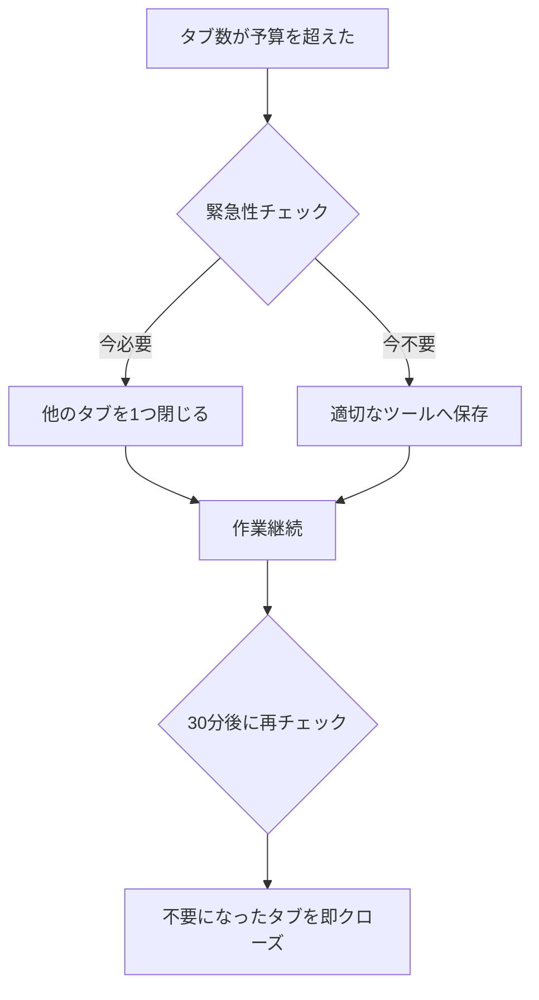

## はじめに：あなたのブラウザ、タブは何個開いていますか?

気づいたらブラウザに50個以上のタブが開いていて、どれが何だか分からなくなった経験はありませんか?「あとで読む」と思って開いたまま放置している記事、進行中のプロジェクトの資料、チャットツール、メールなど、現代のナレッジワーカーのブラウザは常に混沌としています。

この記事では、私が実際に試行錯誤して効果を実感した**ブラウザタブの管理術**と、それを通じた**仕事効率化の実践方法**を紹介します。単なる整理術ではなく、認知負荷を減らし、集中力を高め、仕事の質を向上させる具体的なテクニックをお伝えします。

**この記事で得られる価値：**
- タブ管理による集中力の向上方法
- 情報の見落としを防ぐ仕組み作り
- 1日30分以上の時間節約につながる習慣
- ストレス軽減と生産性向上の両立

## なぜタブ管理が重要なのか？認知負荷の真実

### 開きすぎたタブが脳に与える影響

心理学の研究によると、人間の作業記憶（ワーキングメモリ）は同時に処理できる情報が限られています。開いているタブ一つ一つが、無意識のうちに私たちの認知リソースを消費しているのです。

**具体的な影響：**
- タスク切り替えコスト：タブ間を行き来するたびに平均23分の集中力ロス
- 意思決定疲労：「どのタブから手をつけるか」という些細な判断の積み重ね
- 視覚的ストレス：小さく縮小されたタブアイコンを探す労力

私自身、以前は常時30〜40個のタブを開いていましたが、後述する方法を実践してから平均10個以下に抑えられるようになり、**午後の集中力が明らかに改善**しました。

## 実践テクニック1：「ゼロベースタブ管理」の導入

### 基本ルール：毎朝タブをゼロにする

最も効果的だったのが、**毎日仕事を始める前に全タブを閉じる**習慣です。「えっ、それは無理」と思うかもしれませんが、適切な仕組みがあれば可能です。

**具体的な手順：**

1. **前日の終業時にタブを整理**
   - 明日も必要なもの → ブックマークフォルダ「明日のタスク」へ
   - あとで読む → Pocketなどの読書リストへ
   - 参考資料 → Notionなどのドキュメントツールへリンク保存

2. **翌朝、必要なタブだけを開く**
   - その日のタスクに必要なもののみ
   - 最大でも5〜7個に制限

### ツール活用例

**Chrome/Edge:**
```
拡張機能「OneTab」の使用
- ワンクリックで全タブをリスト化
- 必要なときに復元可能
- メモリ使用量95%削減
```

**Firefox:**
```
標準機能「タブグループ」を活用
- プロジェクトごとにグループ化
- 使わないグループは折りたたみ
```

## 実践テクニック2：「3つのワークスペース」法

### タブを機能別に分類する

複数のブラウザウィンドウやプロファイルを使って、作業を明確に分離します。

**ワークスペース1：集中作業用（メインウィンドウ）**
- 現在取り組んでいるタスクに直接関係するもののみ
- 理想は3〜5個
- 例：執筆中のドキュメント、関連する技術資料、開発環境

**ワークスペース2：コミュニケーション用（別ウィンドウ）**
- Slack、Gmail、カレンダーなど
- 通知は必要最小限に設定
- 定期的にチェックするスケジュールを決める（例：1時間に1回）

**ワークスペース3：参照・リサーチ用（必要時のみ）**
- 調べ物をするときだけ開く
- 作業が終わったら即座にクローズ

### プロファイル活用の実例

Chromeの複数プロファイル機能を使った実際の設定例：

```
プロファイル1【仕事用】
├─ 常時開くタブ：プロジェクト管理ツール、社内Wiki
├─ 拡張機能：セキュリティツール、VPN
└─ テーマ：青系（集中モード）

プロファイル2【リサーチ用】
├─ 常時開くタブ：なし（都度開く）
├─ 拡張機能：翻訳ツール、スクリーンショット
└─ テーマ：緑系（学習モード）

プロファイル3【プライベート】
├─ 完全分離で仕事時間には開かない
```

## 実践テクニック3：「あとで読む」の適切な処理

### 無限に溜まる「あとで読む」問題の解決

多くの人が陥る罠が、「あとで読む」タブの無限蓄積です。これを解決する具体的な仕組みを紹介します。

**ステップ1：即座に振り分ける（5秒ルール）**
- 5秒以内に判断：今読むか、本当に必要か
- 必要なら適切なツールへ移動
- 不要なら即クローズ

**ステップ2：専用ツールの活用**

| ツール | 用途 | おすすめの使い方 |
|--------|------|------------------|
| Pocket | 長文記事 | 週次レビューでまとめ読み |
| Notion | 業務参考資料 | プロジェクト別ページに整理 |
| GitHub Gist | コードスニペット | タグ付けして検索可能に |
| Raindrop.io | ビジュアル重視の資料 | カテゴリ別コレクション |

**ステップ3：定期レビューの実装**

毎週金曜日の15時から30分間、「情報整理タイム」を設定：

```markdown
【金曜日の情報整理チェックリスト】
□ Pocketの未読記事を確認（読む/削除/保存）
□ ブラウザのブックマークバーを整理
□ 「明日のタスク」フォルダを空にする
□ 来週の重要タブを事前準備
□ 不要な拡張機能を無効化
```

## 実践テクニック4：タブ数に「予算」を設ける

### 心理的制約が生む効率

プロジェクト管理における「制約理論」を応用します。タブ数に上限を設けることで、本当に重要なものだけを開く習慣が身につきます。

**推奨タブ予算：**
- 通常作業時：5〜7個
- リサーチ作業時：10〜12個
- 緊急対応時：15個まで（一時的）

### 予算オーバー時の対処フロー



## 実践テクニック5：「セッション」という概念の活用

### 作業セッションごとにタブをリセット

ポモドーロ・テクニックと組み合わせた方法です。25分の集中作業（1ポモドーロ）ごとに、タブ環境をリフレッシュします。

**実践例：**

```
09:00-09:25【セッション1】メール対応
├─ 開くタブ：Gmail、Slack、カレンダー
└─ 終了時：全クローズ

09:30-09:55【セッション2】記事執筆
├─ 開くタブ：Googleドキュメント、参考記事×2
└─ 終了時：ドキュメント以外クローズ

10:00-10:25【セッション3】コードレビュー
├─ 開くタブ：GitHub、ローカル環境、関連Issue
└─ 終了時：Issue以外クローズ
```

### セッション管理ツール

**拡張機能「Workona」の活用：**
- セッション（プロジェクト）ごとにタブをグループ化
- ワンクリックで切り替え
- 自動保存で復元も簡単

```javascript
// 自作スクリプト例（Chrome拡張）
// 特定時間後に未使用タブを自動クローズ
chrome.tabs.query({}, function(tabs) {
  const now = Date.now();
  tabs.forEach(tab => {
    if (now - tab.lastAccessed > 1800000) { // 30分
      chrome.tabs.remove(tab.id);
    }
  });
});
```

## 実践テクニック6：ピン留め機能の戦略的活用

### 常時必要なタブだけをピン留め

ピン留めは便利ですが、使い方を間違えると逆効果です。

**ピン留めすべきタブ（3〜5個まで）：**
1. **コミュニケーションツール**（Slack/Teams）
2. **カレンダー**（次の予定を常に意識）
3. **タスク管理ツール**（Notion/Trello）
4. **開発環境**（GitHub/ローカルサーバー）※開発者の場合

**ピン留めしてはいけないもの：**
- 「あとで読む」記事
- 一時的な参照資料
- 頻度の低い管理画面

### ピン留めのルール化

```
【ピン留めルール】
✓ 1日に5回以上アクセスするもの
✓ 常に最新状態を確認する必要があるもの
✗ 週に1回程度しか使わないもの
✗ 特定タスクにのみ必要なもの

【月次レビュー】
毎月1日にピン留めタブを見直し
→ 3ヶ月使っていないタブは解除
```

## 実践テクニック7：「タブ断捨離」の週次習慣

### 情報の新陳代謝を促す

デジタル情報も物理的なモノと同じく、定期的な断捨離が必要です。

**金曜日の「タブ大掃除」ルーチン：**

**15:00-15:30 タブ棚卸し**
```markdown
1. 全タブをリストアップ（OneTabなどで視覚化）
2. 各タブに質問する
   - 今週使った？ → No なら削除候補
   - 来週使う予定ある？ → No なら削除候補
   - 保存する価値ある？ → No なら即削除
3. 残すと決めたものは適切に整理
   - ブックマーク化
   - ドキュメントへリンク保存
   - タスクとして記録
```

**削除判断のチェックリスト：**

| 質問 | Yes → | No → |
|------|-------|------|
| このタブを閉じたら困る？ | 保持 | 次へ |
| URLをブックマークに入れた？ | 保持可能 | 次へ |
| 同じ情報に再アクセスする可能性は？ | 保存して閉じる | 削除 |

## タブ管理がもたらした実際の変化

### 私の3ヶ月間の実践結果

この方法を実践して3ヶ月後、以下の変化がありました：

**定量的な変化：**
- 平均タブ数：42個 → 8個（81%削減）
- タブ探索時間：1日合計40分 → 5分（87.5%削減）
- ブラウザメモリ使用量：4.5GB → 1.2GB
- 1日の集中作業時間：4.5時間 → 6.2時間（38%増加）

**定性的な変化：**
- 「何か忘れているかも」という不安の軽減
- 作業開始時の心理的ハードルの低下
- 情報を「持っている」ではなく「必要