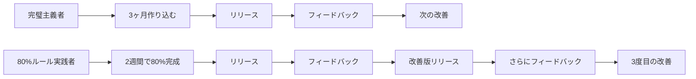

## はじめに：完璧主義がもたらす見えないコスト

あなたは「もう少し完璧にしてから」と言って、プロジェクトのリリースを先延ばしにした経験はありませんか?

エンジニアやクリエイターの多くが陥りがちな「完璧主義の罠」。実は、この思考パターンが生産性を大きく下げている可能性があります。

この記事では、完璧を目指しすぎることで失っているものを可視化し、**80%の完成度で前に進む思考法**を実践的に解説します。読み終えた後、あなたは「完璧ではないけれど価値があるものを素早く届ける」スキルを手に入れることができます。

:::message
この記事は以下のような方におすすめです
- いつも締め切りギリギリになってしまう
- 完璧にできないなら出さない方がマシだと思ってしまう
- 他人の目が気になって行動できない
- 副業やOSS活動を始めたいけど踏み出せない
:::

## 完璧主義がもたらす3つの大きな損失

### 1. 機会損失：完璧を待っている間に市場が変わる

技術トレンドの移り変わりは驚くほど速いです。あなたが「完璧な記事」を書いている間に、そのトピックの旬は過ぎているかもしれません。

**具体例：**
- 新しいフレームワークのチュートリアルを「完璧に」書こうとして3ヶ月かかる
- その間に公式ドキュメントが充実し、競合記事が100本出る
- 結果的にあなたの記事の価値は相対的に下がってしまう

```
完璧な1本（3ヶ月後） < 80%の完成度の3本（各1ヶ月）
```

### 2. 学習機会の損失：フィードバックループが回らない

完璧主義者は「完璧になってから人に見せたい」と考えます。しかし、これは最も重要な学習機会を逃しています。

**フィードバックループの比較：**



80%ルールを実践すると、同じ期間で**3回のフィードバックサイクル**を回せます。

### 3. 心理的消耗：完璧主義は自己肯定感を下げる

完璧を求めすぎると、常に「まだ足りない」という感覚に苛まれます。これは長期的に見て、モチベーションと創造性を奪います。

## 80%ルールとは：パレートの法則の実践的応用

**80%ルール**とは、「80%の完成度で一度区切りをつけて前に進む」という思考法です。

これはパレートの法則（80:20の法則）の応用で、以下の原則に基づいています：

- **80%の価値は、20%の時間で生み出せる**
- 残り20%の完成度を上げるために、80%の時間を使ってしまう
- その時間は、新しいプロジェクトに投資した方が高い価値を生む

### 80%ルールが適用できる場面

| シーン | 完璧主義的アプローチ | 80%ルールアプローチ |
|--------|-------------------|-------------------|
| 技術記事執筆 | すべての辺境ケースを調べてから公開 | 主要ユースケースを網羅して公開、コメントで補完 |
| 個人開発 | すべての機能を実装してからリリース | MVPを2週間で作り、ユーザーの反応を見る |
| プレゼン資料 | 完璧なデザインとアニメーション | 内容に集中、デザインはシンプルに |
| コードレビュー | 完璧なリファクタリングまで求める | 動作の正しさとメンテナンス性を確認 |

## 実践編：80%ルールを習慣化する5つのステップ

### ステップ1：「完成」の定義を明確にする

完璧主義者の最大の問題は、「完成」が曖昧なことです。

**Before:**
「良い感じになったら公開しよう」

**After:**
「以下の条件を満たしたら公開する」
- 主要な3つのユースケースをカバーしている
- 実行可能なコードサンプルが含まれている
- 誤字脱字をチェックした

```javascript
// タスク管理に「完了条件」を明記する習慣をつける
const task = {
  title: "React Hooksの記事を書く",
  doneWhen: [
    "useState, useEffect, useContextの基本を説明",
    "実際に動くサンプルコードを3つ掲載",
    "よくあるミスと解決法を2つ紹介"
  ],
  notRequired: [
    "すべてのHooksを網羅する",
    "TypeScriptの型定義を完璧に説明",
    "パフォーマンス最適化の詳細"
  ]
};
```

### ステップ2：タイムボックスを設定する

時間で区切ることで、完璧を追求しすぎることを防ぎます。

**ポモドーロテクニックの応用:**
1. この記事に使える時間は「ポモドーロ8セット（4時間）」と決める
2. 各セッションで達成する小目標を設定
3. 時間が来たら、その時点でのベストを採用する

```
セッション1-2: 構成とアウトライン作成
セッション3-5: 本文執筆
セッション6-7: コードサンプル追加と見直し
セッション8: 最終チェックと公開準備

→ 8セット終わったら、その状態で公開する
```

### ステップ3：「バージョン思考」を取り入れる

ソフトウェア開発のバージョニングを、あらゆる成果物に適用します。

```
v0.8: 80%完成版を公開（公開することに価値がある）
v0.9: フィードバックを反映して改善
v1.0: 安定版としてブラッシュアップ
v1.1: 追加要望に応えた機能追加
```

**実践例：**
- ブログ記事も「v1.0」として公開し、後から「2024年12月更新版」として改訂
- GitHubのプロジェクトは早期に公開し、"WIP" や "alpha" タグをつける
- プレゼン資料も「初回版」として割り切り、次回改善する

### ステップ4：「Done is better than perfect」を可視化する

自分の行動を客観的に見るため、完了した成果物を記録します。

**トラッキング例:**

```markdown
## 2024年12月の成果

### 80%ルールで完了させたもの
- [ ] 技術記事3本公開（平均執筆時間: 4時間）
- [ ] OSS へのPR 5件（1件あたり平均2時間）
- [ ] 個人開発アプリのMVPリリース（2週間）

### 完璧主義で止まっていたら
- おそらく記事1本も出せなかった
- PRは完璧を期して出せなかった
- アプリは「もう少し機能を追加してから」と未リリース
```

このように可視化すると、**80%で前に進むことの価値**が実感できます。

### ステップ5：フィードバックを改善の燃料にする

80%で出すことの最大のメリットは、**早期にフィードバックを得られること**です。

**フィードバックの活用フロー:**

1. 記事やプロダクトを80%の状態で公開
2. コメントやリアクションを収集
3. 「次のバージョンで改善すべき点」をリスト化
4. 優先度をつけて順次改善

```javascript
// フィードバック管理の例
const feedbacks = [
  { type: "誤字", priority: "high", effort: "low" },
  { type: "サンプルコード追加要望", priority: "medium", effort: "medium" },
  { type: "別フレームワーク対応希望", priority: "low", effort: "high" }
];

// 優先度が高く、工数が低いものから対応
const nextActions = feedbacks
  .filter(f => f.priority !== "low")
  .sort((a, b) => a.effort.localeCompare(b.effort));
```

## 完璧主義と80%ルールのバランス：使い分けの基準

すべてを80%で済ませるべきではありません。状況によって使い分けが重要です。

### 完璧を目指すべき場面

✅ **安全性・セキュリティに関わる実装**
- 認証・認可ロジック
- 金融取引に関わるコード
- ユーザーデータの取り扱い

✅ **法的・契約的な文書**
- 利用規約
- プライバシーポリシー
- 業務委託契約書

✅ **公式ドキュメント・API仕様**
- プロダクトの正式な仕様書
- 多くの開発者が依存するAPI設計

### 80%ルールが有効な場面

✅ **学習・実験的なプロジェクト**
- 新技術を試すための個人開発
- 技術検証のためのプロトタイプ

✅ **ブログ記事・ナレッジシェア**
- 技術記事やチュートリアル
- 学んだことの備忘録

✅ **アイデアの検証段階**
- MVP（Minimum Viable Product）
- ユーザーインタビュー用のモックアップ

## 完璧主義を手放すための心理的アプローチ

### 認知の歪みを修正する

完璧主義者が陥りがちな思考パターンとその修正方法：

| 歪んだ思考 | 現実的な思考 |
|----------|------------|
| 「完璧でないと意味がない」 | 「60%でも誰かの役に立てる」 |
| 「批判されたら終わりだ」 | 「批判は改善のヒント」 |
| 「失敗は許されない」 | 「失敗は学習の一部」 |
| 「他人と比べて劣っている」 | 「自分の成長曲線に集中」 |

### 「アクション・バイアス」を活用する

人は行動することで、考えすぎる癖から抜け出せます。

**5秒ルール:**
1. やろうかどうか迷ったら5秒数える
2. 5秒以内に行動を開始する
3. 考える前に手を動かす

```bash
# 例：新しいプロジェクトを始めるとき
# 5秒以内にこれを実行する
mkdir new-project && cd new-project && git init
echo "# Project Started" > README.md
```

### セルフコンパッションを実践する

自分に対して友人に接するように優しく接することが、完璧主義からの脱却につながります。

**セルフトークの例:**

❌ 「また完璧にできなかった。自分はダメだ」
✅ 「80%できた。次はもっと良くなる。今日の自分を認めよう」

## 実践者の声：80%ルールで変わった働き方

### ケーススタディ1：ブログ執筆

**Before:**
- 記事を書き始めるも、「これで十分か?」と悩み、公開できずに終わる
- 年間公開記事数：2本

**After（80%ルール導入後）:**
- 「読者が困っていることを解決できればOK」と割り切る
- 4時間以内に執筆→公開のサイクルを確立
- 年間公開記事数：24本（12倍！）
- フィードバックをもとに人気記事は随時更新

### ケーススタディ2：個人開発

**Before:**
- アイデアはあるが「完璧な設計」を考えすぎて着手できない
- 1年間でリリースしたプロダクト：0個

**After（80%ルール導入後）:**
- MVPを2