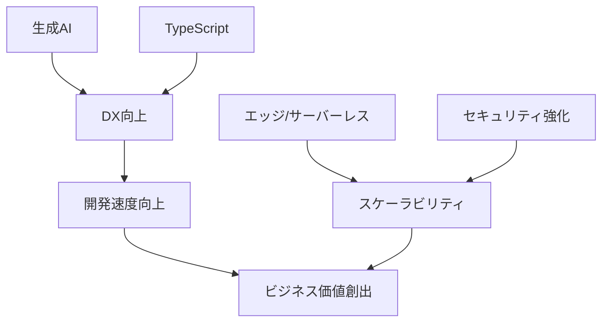

## はじめに

2024年は技術業界にとって大きな転換点となる年でした。生成AIの実用化が加速し、開発手法やツールチェーンが劇的に変化する中、エンジニアには新しいスキルセットが求められています。

本記事では、2024年に顕著だった技術トレンドを5つに整理し、それぞれがエンジニアの日常業務やキャリアにどのような影響を与えているのかを解説します。これから学ぶべきことや、実務でどう活用できるかという観点で、実践的な情報をお届けします。

**この記事で得られる価値**
- 2024年の主要技術トレンドの全体像の把握
- 各トレンドの実務への影響と活用方法
- 今後のスキル習得の優先順位づけに役立つ知見

## 1. 生成AIの開発ワークフローへの統合

### AIアシスタントツールの台頭

2024年最大のトピックは、GitHub CopilotやCursor、Amazon CodeWhispererなどのAIコーディングアシスタントが開発の標準ツールになったことです。

**具体的な変化**
- コード補完の精度向上により、定型的な実装時間が30-50%削減
- テストコードの自動生成が一般化
- ドキュメント作成の効率が大幅に改善

```typescript
// AIアシスタントによる実装例
// プロンプト: "ユーザー認証のミドルウェアを実装して"

import { Request, Response, NextFunction } from 'express';
import jwt from 'jsonwebtoken';

interface AuthRequest extends Request {
  userId?: string;
}

export const authMiddleware = async (
  req: AuthRequest,
  res: Response,
  next: NextFunction
) => {
  try {
    const token = req.headers.authorization?.split(' ')[1];
    
    if (!token) {
      return res.status(401).json({ error: 'No token provided' });
    }

    const decoded = jwt.verify(token, process.env.JWT_SECRET!) as { userId: string };
    req.userId = decoded.userId;
    
    next();
  } catch (error) {
    return res.status(401).json({ error: 'Invalid token' });
  }
};
```

### 実務での活用ポイント

1. **コンテキストの提供が重要**: AIに適切な背景情報を与えることで出力品質が向上
2. **レビューは必須**: 生成されたコードの妥当性検証は人間の責任
3. **セキュリティ意識**: 機密情報をプロンプトに含めない運用ルールの整備

### 今後のスキル要件

- プロンプトエンジニアリング能力
- AIの出力を評価・改善する力
- ドメイン知識の重要性がより高まる

## 2. エッジコンピューティングとサーバーレスの進化

### Vercel、Cloudflare Workersの躍進

エッジでの処理が当たり前になり、グローバル配信のハードルが大きく下がりました。

**主な利点**
- レイテンシの劇的な改善（100ms以下のレスポンス）
- 地域ごとのパーソナライゼーション実装が容易に
- コスト効率の向上

```javascript
// Cloudflare Workers での例
export default {
  async fetch(request, env) {
    const country = request.cf.country;
    
    // 地域ごとに異なるコンテンツを配信
    const content = await env.KV.get(`content:${country}`);
    
    return new Response(content, {
      headers: {
        'Content-Type': 'text/html',
        'Cache-Control': 'public, max-age=3600'
      }
    });
  }
}
```

### 実践的な使い分け

| ユースケース | 推奨プラットフォーム | 理由 |
|------------|------------------|------|
| 静的サイト配信 | Vercel/Netlify | ビルド・デプロイの容易さ |
| API Gateway | Cloudflare Workers | グローバル分散・低レイテンシ |
| 複雑なバッチ処理 | AWS Lambda | 実行時間・リソースの柔軟性 |

## 3. TypeScriptのさらなる普及とエコシステム成熟

### なぜTypeScriptが「当たり前」になったのか

2024年、新規プロジェクトでJavaScriptのみを選択するケースは少数派になりました。

**普及を後押しした要因**
- フレームワークのデフォルトがTypeScriptに（Next.js 14、Nuxt 3など）
- エディタサポートの向上でDX（開発者体験）が飛躍的に改善
- 型による自己文書化がチーム開発の効率を高める

```typescript
// 2024年スタンダードな型定義パターン
type User = {
  id: string;
  email: string;
  profile: {
    name: string;
    avatarUrl?: string;
  };
  createdAt: Date;
};

// 型ガードで安全性を確保
function isValidUser(data: unknown): data is User {
  return (
    typeof data === 'object' &&
    data !== null &&
    'id' in data &&
    typeof data.id === 'string' &&
    'email' in data &&
    typeof data.email === 'string'
  );
}

// APIレスポンスの型安全な処理
async function fetchUser(id: string): Promise<User> {
  const response = await fetch(`/api/users/${id}`);
  const data = await response.json();
  
  if (!isValidUser(data)) {
    throw new Error('Invalid user data');
  }
  
  return data;
}
```

### 学習曲線を乗り越えるコツ

1. **段階的な導入**: 既存プロジェクトはanyから始めて徐々に厳密化
2. **ユーティリティ型の活用**: Pick、Omit、Partialなどで効率的に型定義
3. **コミュニティパターンの参照**: type-challengesなどで実践練習

## 4. 開発者体験（DX）重視の潮流

### ローカル開発環境の革新

Vite、Turbopack、Biomeなど、開発者の生産性を高めるツールが成熟しました。

**具体的な改善指標**
- ホットリロード時間: 数秒 → 数十ミリ秒
- ビルド時間: 分単位 → 秒単位
- Linting/Formatting: 秒単位 → ミリ秒単位

```json
// package.json - 2024年の標準的な構成
{
  "scripts": {
    "dev": "vite",
    "build": "tsc && vite build",
    "lint": "biome check .",
    "format": "biome format --write .",
    "test": "vitest"
  },
  "devDependencies": {
    "@biomejs/biome": "^1.4.0",
    "vite": "^5.0.0",
    "vitest": "^1.0.0",
    "typescript": "^5.3.0"
  }
}
```

### モノレポ管理の標準化

Turborepo、Nx、pnpm workspacesにより、複数パッケージの統合管理が容易になりました。

**モノレポのメリット**
- コード共有の効率化
- 依存関係の一元管理
- CI/CDの最適化（変更検知による部分ビルド）

## 5. セキュリティとプライバシーの最優先化

### ゼロトラストアーキテクチャの普及

境界防御からゼロトラストへの移行が加速しています。

**実装の基本原則**
1. **最小権限の原則**: 必要最小限のアクセス権のみ付与
2. **継続的な検証**: すべてのリクエストを検証
3. **セグメンテーション**: マイクロセグメント化で被害範囲を限定

```typescript
// 属性ベースアクセス制御（ABAC）の実装例
type Permission = {
  resource: string;
  action: 'read' | 'write' | 'delete';
  conditions?: {
    department?: string;
    role?: string;
    timeRange?: { start: string; end: string };
  };
};

function checkPermission(
  user: User,
  permission: Permission
): boolean {
  // リソースとアクションの基本チェック
  if (!user.permissions.includes(`${permission.resource}:${permission.action}`)) {
    return false;
  }
  
  // 条件付きアクセス制御
  if (permission.conditions) {
    if (permission.conditions.department && 
        user.department !== permission.conditions.department) {
      return false;
    }
    
    if (permission.conditions.role && 
        !user.roles.includes(permission.conditions.role)) {
      return false;
    }
  }
  
  return true;
}
```

### データプライバシー規制への対応

GDPR、CCPA等への準拠が必須要件化しています。

**実装チェックリスト**
- [ ] データの暗号化（保存時・転送時）
- [ ] ユーザー同意管理の実装
- [ ] データ削除機能の提供
- [ ] アクセスログの記録と監査

## 各トレンドの相互関係

これら5つのトレンドは独立しているわけではなく、相互に影響し合っています。



例えば、TypeScriptによる型安全性とAIアシスタントの組み合わせは、より高品質なコード生成を実現します。また、エッジコンピューティングとゼロトラストアーキテクチャの組み合わせは、高速かつセキュアなアプリケーション配信を可能にします。

## エンジニアが今やるべきこと

### 短期的アクション（3ヶ月以内）

1. **AIアシスタントツールの導入**
   - GitHub CopilotまたはCursorを実務で試用
   - プロンプトの書き方を学ぶ

2. **TypeScriptへの移行検討**
   - 小規模プロジェクトから段階的に導入
   - 型定義の基礎を固める

3. **エッジプラットフォームの体験**
   - Vercel/Cloudflareで簡単なデモアプリを作成
   - パフォーマンス特性を体感

### 中長期的取り組み（6ヶ月〜1年）

1. **セキュリティ知識の体系的学習**
   - OWASP Top 10の理解
   - ゼロトラストアーキテクチャの設計パターン習得

2. **モノレポ/マイクロサービスの経験**
   - 複雑なシステムアーキテクチャへの理解を深める

3. **コミュニティ活動への参加**
   - OSSへのコントリビューション
   - 技術カンファレンスへの参加・登壇

## まとめ

2024年の技術トレンドは、以下の5つに集約されます。

1. **生成AIの統合** - 開発プロセスの自動化・効率化
2. **エッジコンピューティング** - グローバルなパフォーマンス最適化
3. **TypeScript普及** - 型安全性による品質向上
4. **DX重視** - 開発者生産性の飛躍的改善
5. **セキュリティ最優先** - ゼロトラストとプライバシー保護

これらのトレンドに共通するのは、**「開発者がビジネス価値により集中できる環境づくり」**という方向性です。ツールやプラットフォームが定型作業を肩代わりすることで、エンジニアはより創造的な問題解決に時間を使えるようになっています。

2025年以降も、これらのトレンドはさらに加速すると予想されます。今のうちに基礎を固めておくことで、将来の技術変化にも柔軟に対応できるでしょう。

**重要なのは、すべてを一度に学ぼうとしないこと**です。自分の業務や興味に近いものから優先的に取り組み、実践を通じて知識を深めていくアプローチをお勧めします。

皆さんのスキルアップの参考になれば幸いです。この記事が役立ったと感じたら、ぜひシェアやいいねをお願いします！

---

**参考リンク**
- [GitHub Copilot Documentation](https://docs.github.com/copilot)
- [TypeScript Handbook](https://www.typescriptlang.org/docs/)
- [Cloudflare Workers Documentation](https://developers.cloudflare.com/workers/)