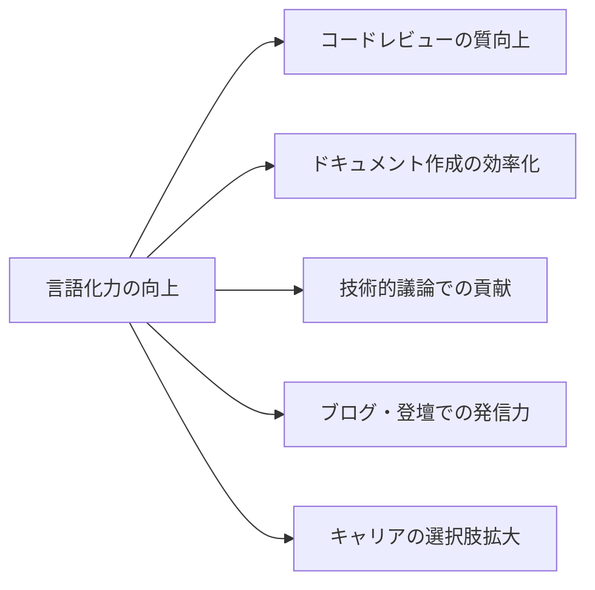

## はじめに - なぜ技術者に「言語化力」が必要なのか

「コードは書けるのに、説明が苦手」
「頭の中では分かっているのに、言葉にできない」
「レビューコメントやドキュメントを書くのに時間がかかる」

こうした悩みを抱えるエンジニアは少なくありません。しかし、技術力が高くても「言語化力」が不足していると、チーム内でのコミュニケーション、技術ブログでの発信、面接やプレゼンテーションなど、多くの場面で損をしてしまいます。

この記事では、**思考を明確にし、相手に伝わるアウトプットを生み出す「言語化力」**を高めるための具体的なトレーニング方法を紹介します。私自身がエンジニアとして実践してきた方法を、すぐに実践できる形でお届けします。

## 言語化力とは何か

### 言語化力の定義

言語化力とは、**頭の中にある漠然とした考えや感覚を、明確な言葉に変換する能力**です。これは単なる「文章力」とは異なります。

- **思考の整理力**: 複雑な考えを構造化する
- **本質の抽出力**: 重要なポイントを見極める
- **表現の選択力**: 相手に応じた言葉を選ぶ
- **論理の構築力**: 筋道立てて説明する

### 技術者にとっての価値



言語化力が高まると、技術力を正しく評価してもらえるようになり、影響力のあるエンジニアへと成長できます。

## トレーニング方法1: デイリーログで思考を可視化する

### 実践方法

毎日5〜10分、その日の学びや気づきを**3行でまとめる**習慣をつけましょう。

**フォーマット例:**

```markdown
## 2024-01-15

### 今日学んだこと
TypeScriptのUtility Typesの中でも`Extract`と`Exclude`の違いが理解できた

### 気づき・疑問
条件分岐が多くなるとテストケースの組み合わせが爆発する。境界値分析を意識すべき?

### 明日やること
Jestのparameterized testを調べて、テストケースを整理する
```

### なぜ効果的なのか

- **制約が思考を鍛える**: 3行という制約が、本質を抽出する訓練になる
- **振り返りで成長が見える**: 過去ログを読むと、自分の成長が可視化される
- **ハードルが低い**: 5分なら続けられる

### 実践のコツ

1. **完璧を求めない**: 箇条書きでOK
2. **ツールは何でも**: Notion、Obsidian、Scrapboxなど使いやすいもので
3. **公開前提にしない**: 自分だけが見る前提で、素直に書く

## トレーニング方法2: 技術的質問に「Why-What-How」で答える

### フレームワークの説明

技術的な質問に答える際、以下の3つの視点を意識します。

```
Why（なぜ）: 背景・目的・課題
What（何を）: 具体的な内容・結論
How（どのように）: 実装方法・手順
```

### 実践例

**質問: 「なぜReactを選んだのですか?」**

❌ **言語化力が低い回答:**
「流行っているからです。あと、使いやすいので。」

✅ **言語化力が高い回答:**

**Why:** このプロジェクトは頻繁なUI変更が予想され、コンポーネントの再利用性が重要でした。また、チームメンバーのJavaScript経験を活かせる技術が必要でした。

**What:** 仮想DOMによる効率的な更新、豊富なエコシステム、TypeScriptとの親和性の高さから、Reactを採用しました。

**How:** Create React Appでプロジェクトを初期化し、TypeScript + React Hooksの構成で、コンポーネント駆動開発を進めています。

### トレーニング方法

1. **自問自答する**: 自分の技術選定を「Why-What-How」で説明してみる
2. **過去の質問を振り返る**: 面接やレビューでの質問を再度考え直す
3. **他者の説明を分析する**: 技術ブログを「Why-What-How」に分解してみる

## トレーニング方法3: 「抽象化の梯子」を上り下りする

### 抽象化の梯子とは

同じ概念を、異なる抽象度で説明できる能力です。

```
【抽象度: 高】
「システム全体のパフォーマンス最適化」
 ↓
「データベースクエリの効率化」
 ↓
「N+1問題の解消」
 ↓
【抽象度: 低】
「ループ内のSELECT文をJOINに書き換える」
```

### 実践ワーク

あなたが最近解決した技術的課題を、3つの抽象度レベルで説明してみましょう。

**例: 表示速度の改善**

- **経営層向け（高）**: ユーザー体験の向上により、離脱率を15%削減しました
- **技術リード向け（中）**: フロントエンドのバンドルサイズを最適化し、初期表示を2秒短縮しました
- **実装者向け（低）**: dynamic importで非同期コンポーネント読み込みを実装し、初期バンドルを300KB削減しました

### なぜ重要なのか

- **相手に合わせた説明ができる**: ステークホルダーごとに適切な粒度で話せる
- **本質理解が深まる**: 抽象化することで、問題の本質が見えてくる
- **提案力が上がる**: 経営的価値と技術的詳細を繋げられる

## トレーニング方法4: 「5分で説明できるか」チャレンジ

### 方法

学んだ技術やフレームワークを、**5分で他者に説明できるようになる**ことを目標にします。

**ステップ:**

1. **タイマーを5分にセット**
2. **声に出して説明する**（独り言でOK）
3. **録音して聞き直す**
4. **改善点をメモする**

### 説明の構成テンプレート

```markdown
## [技術名] の5分解説

### 1分目: 一言で何か + 背景
「〇〇は、△△を解決するための□□です」

### 2-3分目: 核心的な特徴を3つ
1. 特徴A（例付き）
2. 特徴B（例付き）
3. 特徴C（例付き）

### 4分目: 実際の使い方（ミニデモ）
簡単なコード例や図解

### 5分目: まとめ + いつ使うべきか
```

### 実践例: GraphQLの5分解説

```
【1分目】
GraphQLは、APIから必要なデータだけを取得できるクエリ言語です。
RESTの「エンドポイントが多すぎる」「欲しいデータが取れない」問題を解決します。

【2-3分目】
特徴1: クライアントが欲しいデータ構造を指定できる
特徴2: 1回のリクエストで複数リソースを取得可能
特徴3: 型システムとスキーマによる自己文書化

【4分目】
query {
  user(id: "123") {
    name
    posts {
      title
    }
  }
}
このクエリで、ユーザー情報と投稿タイトルを一度に取得

【5分目】
フロントエンドの表示要件が複雑で、柔軟なデータ取得が必要な場合に有効。
ただし学習コストがあるので、シンプルなCRUDならRESTで十分です。
```

## トレーニング方法5: 「なぜ?」を5回繰り返す

### トヨタ式「5回のなぜ」を技術思考に応用

問題や技術選定の理由を深掘りすることで、**真の理解と言語化**が可能になります。

### 実践例

**状況: ビルド時間が長い**

```
なぜ1: ビルドが遅いのか?
→ Webpackのコンパイルに時間がかかっているから

なぜ2: Webpackのコンパイルが遅いのか?
→ すべてのファイルを毎回フルビルドしているから

なぜ3: フルビルドしているのか?
→ キャッシュ設定が適切でないから

なぜ4: キャッシュ設定が適切でないのか?
→ cache-loaderの設定が漏れていたから

なぜ5: cache-loaderの設定が漏れていたのか?
→ 開発環境と本番環境で設定ファイルを分けておらず、管理が複雑だったから

【結論】
環境別の設定ファイル分離と、適切なキャッシュ戦略の導入が必要
```

### このトレーニングの効果

- **表面的理解から脱却**: 「なんとなく」が「明確な理由」になる
- **根本原因の発見**: 対症療法ではなく、本質的な解決策が見つかる
- **説明力の向上**: 深い理解があるから、簡潔に説明できる

## トレーニング方法6: 技術ブログを書く（下書きでもOK）

### なぜブログが最強のトレーニングなのか

技術ブログは、言語化力を総合的に鍛える最も効果的な方法です。

**鍛えられるスキル:**
- 情報の構造化
- 読者目線での説明
- 適切な粒度の選択
- 継続的なアウトプット習慣

### ハードルを下げるコツ

「完璧な記事を書かなければ」と思うと続きません。以下の方法で始めましょう。

**ステップ1: 自分用メモから始める**
```markdown
# 今日のトラブルシューティング

## 問題
Next.jsでISRが効かない

## 原因
revalidateの設定がgetStaticPropsではなくgetServerSidePropsに書いてた

## 解決
getStaticPropsに移動して revalidate: 60 を追加

## 学び
ISRはStatic Generation専用の機能。SSRとの違いを再確認した
```

**ステップ2: テンプレート化する**
```markdown
# [技術名]で[課題]を解決した話

## 背景・課題

## 選択した技術と理由

## 実装のポイント

## ハマったところ

## 結果・学び
```

**ステップ3: 公開のハードルを下げる**
- Zennのスクラップ機能を使う
- 「完璧」ではなく「誰かの役に立つかも」を基準にする
- 短い記事から始める（1000文字でも価値がある）

### 継続のためのマインドセット

- **アウトプットは資産**: 未来の自分や他者への贈り物
- **完璧主義を捨てる**: 60点で公開→フィードバック→改善のサイクル
- **小さく始める**: 週1回の長文より、週3回の短文

## 言語化力を高める日常習慣

### 習慣1: Slackやコメントで「一言多く」書く

```
❌ 「直しました」
✅ 「指摘のあった型定義の曖昧さを修正しました。Utility Typesで厳密にしています」

❌ 「エラーが出ます」
✅ 「ログイン後に403エラー。JWTの期限切れが原因と思われます。確認お願いします」
```

**効果**: 短文でも論理的に伝える訓練になる

### 習慣2: 他者の技術記事に「要約コメント」をつける

読んだ記事を自分の言葉で3行にまとめてコメントする習慣をつけましょう。

```markdown
【要約】
1. この記事は○○