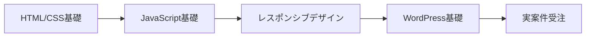

## はじめに：副業で人生の選択肢を増やそう

「給料だけでは将来が不安…」「自分のスキルでお金を稼いでみたい」そんな思いを持つ方が増えています。

本記事では、副業未経験から**月5万円の副収入を得るまでの具体的なロードマップ**を紹介します。私自身が実践し、またメンターとして多くの方をサポートしてきた経験をもとに、再現性の高い方法をまとめました。

### この記事で得られること

- 副業の始め方と準備すべきこと
- スキル別おすすめ副業5選
- 月5万円達成までの具体的ステップ
- 失敗しないための注意点
- 確定申告などの税金対策

所要時間：約10分
対象者：副業初心者〜月3万円未満の方

---

## 副業を始める前の準備

### 1. 会社の就業規則を確認する

まず最初に行うべきは**就業規則の確認**です。

```markdown
【チェックポイント】
□ 副業禁止規定の有無
□ 許可制か届出制か
□ 競業避止義務の範囲
□ 労働時間の制限
```

最近は副業解禁企業が増えていますが、事前確認は必須です。トラブルを避けるため、人事部門に相談することをおすすめします。

### 2. 時間の棚卸しをする

副業に充てられる時間を具体的に算出しましょう。

**平日の例：**
- 朝活：6:00-7:30（1.5時間）
- 昼休み：12:30-13:00（0.5時間）
- 帰宅後：21:00-23:00（2時間）

**週末の例：**
- 土曜：3-5時間
- 日曜：3-5時間

現実的な目標は**週10〜15時間**です。無理なスケジュールは継続できません。

### 3. 目標設定をSMARTに行う

曖昧な目標ではなく、具体的な数値目標を設定します。

**悪い例：**「副業で稼ぎたい」

**良い例：**
- 3ヶ月後：月1万円達成
- 6ヶ月後：月3万円達成
- 12ヶ月後：月5万円達成

このように段階的な目標を設定することで、モチベーションを維持できます。

---

## スキル別おすすめ副業5選

### 1. Webライティング【初心者向け★★★★★】

**必要スキル：** 基本的な文章力
**初期投資：** ほぼ0円
**月5万円達成目安：** 3-6ヶ月

#### 始め方

1. クラウドソーシングサイトに登録
   - クラウドワークス
   - ランサーズ
   - ココナラ

2. 初案件は単価より実績重視
   - 文字単価0.5円〜でも受注
   - 5件の実績を作る

3. ポートフォリオを構築
   - noteやZennで記事を公開
   - 得意分野を明確にする

#### 収益化の目安

```
【月5万円のシミュレーション】
文字単価1.5円 × 3,000文字 × 12本 = 54,000円

または

文字単価2.0円 × 2,500文字 × 10本 = 50,000円
```

**コツ：** 特化型ライターになると単価が上がります（金融、不動産、IT、医療など）。

### 2. プログラミング・コーディング【経験者向け★★★★☆】

**必要スキル：** HTML/CSS、JavaScript基礎
**初期投資：** 学習費用3-10万円
**月5万円達成目安：** スキルにより即日〜6ヶ月

#### おすすめ案件タイプ

- LP（ランディングページ）制作：3-5万円/件
- WordPress構築：5-10万円/件
- 既存サイトの修正：5,000-20,000円/件

#### 学習ロードマップ



**実践的な学習方法：**
- Progateで基礎学習（月額1,078円）
- Udemyで実践コース受講（1,500-2,000円）
- 模写コーディングで練習

### 3. デザイン制作【クリエイティブ志向★★★★☆】

**必要スキル：** デザインツールの基本操作
**初期投資：** Adobe CC 3,280円/月 or Canva Pro 1,500円/月
**月5万円達成目安：** 4-8ヶ月

#### 需要の高いデザイン案件

1. **バナー制作**：1,000-5,000円/枚
2. **サムネイル制作**：500-2,000円/枚
3. **ロゴデザイン**：10,000-50,000円/件
4. **名刺デザイン**：3,000-10,000円/件

**月5万円の内訳例：**
- バナー制作（2,000円）× 15件 = 30,000円
- サムネイル（1,000円）× 20件 = 20,000円
- **合計：50,000円**

### 4. 動画編集【需要急増中★★★★☆】

**必要スキル：** 編集ソフトの基本操作
**初期投資：** PC + Adobe Premiere Pro（約15万円〜）
**月5万円達成目安：** 3-6ヶ月

#### YouTube編集の相場

- 10分動画：3,000-8,000円/本
- テロップ・効果音付き：5,000-15,000円/本
- サムネイル込み：+1,000-3,000円

**効率化のポイント：**
```
テンプレート化することで作業時間を短縮
→ 1本2-3時間で完成
→ 時給2,000円以上を実現可能
```

### 5. スキル販売・コンサルティング【専門知識活用★★★☆☆】

**必要スキル：** 何かしらの専門知識・経験
**初期投資：** 0円〜
**月5万円達成目安：** 即日〜6ヶ月

#### ココナラでの販売例

- 転職相談：60分 5,000円
- Excel自動化代行：10,000-30,000円
- 資料作成代行：5,000-20,000円
- 語学レッスン：1時間 3,000円

**あなたの「当たり前」が誰かの「価値」です。**

---

## 月5万円達成までの3ステップ

### ステップ1：最初の1円を稼ぐ（1-2ヶ月目）

**目標：実績を作る**

- 単価よりも件数重視
- 評価を積み上げる
- プロフィールを充実させる

```markdown
【この期間の目標収益】
月3,000-10,000円
```

**メンタル面の注意：**
最初は時給換算すると低くても気にしない。この時期は「投資期間」と割り切りましょう。

### ステップ2：単価を上げる（3-4ヶ月目）

**目標：文字単価・案件単価を1.5倍にする**

実績ができたら：
1. プロフィールに実績を追加
2. ポートフォリオをブラッシュアップ
3. 単価交渉または高単価案件に応募

```markdown
【この期間の目標収益】
月20,000-30,000円
```

**値上げの具体例：**
- ライティング：0.5円 → 1.0円
- デザイン：1,000円/件 → 2,000円/件
- 動画編集：3,000円/本 → 5,000円/本

### ステップ3：仕組み化する（5-6ヶ月目）

**目標：効率化と安定化**

- リピーター獲得
- 作業テンプレート化
- 外注化の検討

```markdown
【この期間の目標収益】
月50,000円以上
```

**仕組み化の例：**
```
テンプレート作成
→ 作業時間30%削減
→ 同じ時間で1.5倍の案件をこなせる
→ 収入1.5倍
```

---

## 失敗しないための5つの注意点

### 1. 本業をおろそかにしない

副業に夢中になりすぎて本業のパフォーマンスが下がると本末転倒です。

**優先順位：**
```
本業 > 健康・睡眠 > 副業
```

### 2. 怪しい「儲かる話」に注意

- 「1日5分で月30万円」→ 詐欺の可能性大
- 初期費用が高額すぎる案件は避ける
- 情報商材の購入は慎重に

### 3. 確定申告を忘れずに

**年間20万円以上の副業収入がある場合、確定申告が必要です。**

```markdown
【必要な準備】
□ 収支の記録（会計ソフト推奨）
□ 領収書の保管
□ 経費の把握
```

おすすめ会計ソフト：
- freee（初心者向け）
- マネーフォワード（機能豊富）

### 4. スキル投資をケチらない

効率的に稼ぐには適切なスキル投資が必要です。

**投資対効果の高い例：**
- オンライン学習（Udemy、Skillshare）
- 有料ツール（デザイン、編集ソフト）
- 書籍・専門書

目安：**月収の10-20%をスキル投資に**

### 5. 健康管理を最優先に

睡眠時間を削っての副業は長続きしません。

**推奨スケジュール：**
- 最低睡眠時間：6-7時間確保
- 週1日は完全休養日
- 適度な運動習慣

---

## 税金と確定申告の基礎知識

### 副業所得の計算方法

```
副業所得 = 収入 - 必要経費
```

### 経費として認められる主なもの

- 通信費（スマホ、ネット代の一部）
- 電気代（使用割合に応じて）
- ソフトウェア利用料
- セミナー・書籍代
- 外注費
- 消耗品費

**記録のコツ：**
```markdown
レシート・領収書は必ず保管
→ クラウド会計ソフトで自動記帳
→ 確定申告時に慌てない
```

### 住民税の注意点

確定申告時に「住民税の徴収方法」で**「自分で納付」**を選択すれば、会社に副業がバレにくくなります。

---

## 実践者の声：成功事例

### ケース1：Webライター Aさん（30代女性）

**開始時：** 完全未経験
**達成期間：** 5ヶ月で月5万円

```markdown
【タイムライン】
1ヶ月目：クラウドソーシング登録、初案件受注（3,000円）
2ヶ月目：10件の実績作り（月15,000円）
3ヶ月目：単価交渉開始（月25,000円）
4ヶ月目：直接契約1件獲得（月38,000円）
5ヶ月目：文字単価1.5円に（月52,000円）
```

**成功のポイント：**
「美容」ジャンルに特化し、専門性を高めた

### ケース2：動画編集者 Bさん（20代男性）

**開始時：** 趣味レベルの編集スキル
**達成期間：** 3ヶ月で月5万円

```markdown
【タイムライン】
1ヶ月目：YouTuber向け編集学習、初案件（8,000円）
2ヶ月目：効率化テンプレート作成（月24,000円）
3ヶ月目：リピーター3名確保（月58,000円）
```

**成功のポイント：**
納期厳守と丁寧なコミュニケーションでリピーター獲得

---

## まとめ：今日から始める副業アクション

### 今すぐできる3つのアクション

1. **就業規則の