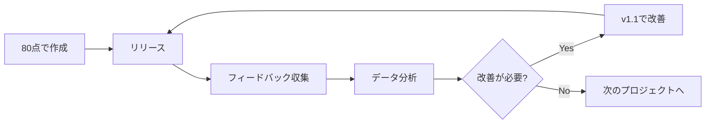

## はじめに

「この記事、もう少し手直ししてから公開しよう」
「このコード、もっとリファクタリングしてから...」
「プレゼン資料、もう一晩考え直してから提出しよう」

こんな言葉を自分に言い聞かせて、結局何もリリースできなかった経験はありませんか?

私は長年、完璧主義に悩まされてきたエンジニアです。しかし「80点で出す」という思考法を取り入れてから、生産性が劇的に向上しました。本記事では、完璧主義から脱却し、より成果を出せるようになった思考の転換方法を共有します。

**この記事で得られること:**
- 完璧主義がなぜ生産性を下げるのかの理解
- 80点主義の具体的な実践方法
- 品質と速度のバランスを取る判断基準
- 明日から使える具体的なテクニック

## 完璧主義がもたらす3つの罠

### 罠1: 無限のブラッシュアップ地獄

完璧主義者は「もう少し良くできるはず」という思考に囚われます。

```javascript
// 完璧主義者の思考パターン
function reviewWork(output) {
  while (true) {
    if (isSatisfied(output)) {
      break; // この条件が永遠に満たされない
    }
    output = improve(output);
  }
  return output; // ここに到達しない
}
```

実際、私が以前書いたブログ記事は、下書きフォルダに3ヶ月眠り続けました。「もう少し事例を追加してから」「表現をもっと洗練させてから」と考えているうちに、情報が古くなり、結局お蔵入りに。

**失ったもの:**
- 3ヶ月分のフィードバック機会
- 読者との対話から得られる気づき
- 記事が話題になるタイミング

### 罠2: 機会損失の連鎖

完璧を求めるあまり、アウトプットが遅れると以下のような機会損失が発生します:

| アクション | 完璧主義の場合 | 80点主義の場合 |
|----------|--------------|--------------|
| 記事執筆 | 1ヶ月で1本 | 1ヶ月で4本 |
| フィードバック回数 | 1回 | 4回 |
| 学びの機会 | 限定的 | 4倍 |
| 改善サイクル | 遅い | 速い |

### 罠3: 心理的負担の増大

完璧を目指すことは、精神的に大きな負担です。

- 常に「まだ足りない」という不安
- 他人の評価への過度な恐れ
- 失敗を許容できないプレッシャー

私自身、完璧主義時代はPull Requestを出すたびに胃が痛くなっていました。「レビューで指摘されたらどうしよう」という恐怖が、コードを書く楽しさを奪っていたのです。

## 80点主義とは何か

80点主義とは、**「最低限の品質基準を満たしたら、まずリリースする」**という思考法です。

### 80点主義の定義

```
80点主義 = 必要十分な品質 + 早期リリース + 継続的改善
```

重要なのは、「手抜き」ではなく「戦略的な優先順位付け」であることです。

### なぜ80点なのか?

この数値には根拠があります:

1. **パレートの法則**: 成果の80%は、労力の20%で達成できる
2. **心理的ハードル**: 80点は「合格ライン」として認知されやすい
3. **改善の余地**: 20%の改善余地を残すことで、フィードバックを活かせる

## 80点主義の実践方法

### ステップ1: 「Done」の定義を明確にする

完璧主義から脱却する第一歩は、「完成」の基準を事前に決めることです。

**記事執筆の場合:**

```markdown
## Doneの定義チェックリスト

- [ ] タイトルと導入文がある
- [ ] 主要なポイントが3つ以上説明されている
- [ ] 具体例が最低1つある
- [ ] 誤字脱字チェックを1回実施
- [ ] 結論がある

以下は「あれば better」(80点超えを目指す場合のみ)
- [ ] 図表の追加
- [ ] 複数の具体例
- [ ] 詳細な参考文献リスト
```

**コード開発の場合:**

```python
class PullRequestChecklist:
    """PRの最低基準"""
    
    MUST_HAVE = [
        "機能が動作する",
        "既存のテストが通る",
        "新機能のテストがある",
        "コードレビューを依頼可能な状態",
    ]
    
    NICE_TO_HAVE = [
        "パフォーマンス最適化",
        "エッジケースの網羅",
        "完璧なドキュメント",
        "リファクタリングの完了",
    ]
    
    def is_ready_for_review(self, pr):
        return all(
            check in pr.completed 
            for check in self.MUST_HAVE
        )
```

### ステップ2: タイムボックスを設定する

作業時間に上限を設けることで、無限ループを防ぎます。

**ポモドーロテクニックの応用:**

```
1. 作業を25分×4セット(2時間)に制限
2. 2時間経過時点でレビュー
3. 80点基準を満たしていればリリース
4. 満たしていなければ、あと1セット(25分)のみ追加
```

私の実例:
- **以前**: ブログ記事に8時間かけて完璧を目指す → 疲弊して公開できず
- **現在**: 2時間で80点を目指す → 公開後、読者の反応を見て必要なら改善

### ステップ3: フィードバックループを組み込む

80点でリリースした後の改善計画を事前に立てます。



**具体的な実践例:**

```markdown
## リリース後の改善計画

### v1.0 (初回リリース - 80点目標)
- 公開日: 2024年1月15日
- 最低限の機能を実装
- 基本的なエラーハンドリング

### v1.1 (フィードバック反映 - 85点目標)
- 公開日: 2024年1月22日
- ユーザーからのフィードバック上位3件に対応
- アナリティクスで発見された問題を修正

### v2.0 (必要なら - 90点目標)
- ユーザー数が閾値を超えた場合のみ実施
- パフォーマンス最適化
- 追加機能の実装
```

## 判断基準: いつ80点で、いつ100点を目指すべきか

すべてを80点で済ませるべきではありません。状況に応じた判断が重要です。

### 80点でOKなケース

✅ **早期のフィードバックが価値を生む場合**
- MVPの開発
- ブログ記事やドキュメント
- 社内向けツール

✅ **失敗のコストが低い場合**
- 個人プロジェクト
- A/Bテストの一方
- プロトタイプ

✅ **素早い改善サイクルが可能な場合**
- Webアプリケーション(デプロイが容易)
- ドキュメント(更新が簡単)

### 100点を目指すべきケース

⚠️ **安全性が重要な場合**
- 医療システム
- 金融取引
- セキュリティ機能

⚠️ **修正が困難な場合**
- ハードウェア設計
- 大規模データ移行
- 印刷物

⚠️ **ブランド影響が大きい場合**
- 公式ドキュメント
- 顧客向け製品リリース
- 法的文書

### 判断フローチャート

```
質問1: 人命や金銭に直接関わる?
 └─ YES → 100点を目指す
 └─ NO → 質問2へ

質問2: 後から修正が容易?
 └─ NO → 95点以上を目指す
 └─ YES → 質問3へ

質問3: 早期フィードバックに価値がある?
 └─ YES → 80点でリリース
 └─ NO → 90点を目指す
```

## 実践テクニック集

### テクニック1: 「公開前プレビュー」を活用

完全公開ではなく、限定公開でフィードバックを得る方法:

```markdown
## 段階的リリース戦略

1. **社内限定公開** (信頼できる同僚3-5人)
   - 大きな問題がないか確認
   - 所要時間: 1日

2. **クローズドベータ** (興味のある早期ユーザー)
   - 実際の使用感をテスト
   - 所要時間: 3-7日

3. **一般公開**
   - フィードバックを元に改善済み
   - 信頼度: 高
```

### テクニック2: 「改善チケット」を作る習慣

80点でリリースする際、改善点をチケット化します。

```markdown
## Issue作成テンプレート

タイトル: [改善] 記事「XXX」の図表追加

説明:
- 現状: テキストのみで説明
- 理想: 図表で視覚的に説明
- 優先度: Low (80点は達成済み)
- 実施条件: PV数が1000を超えたら
```

これにより:
- 「やり残し感」が軽減される
- 優先順位に基づいて後から対応できる
- 完璧主義の呪縛から解放される

### テクニック3: 「2週間後レビュー」

リリース後、2週間経ってから見直す習慣を作ります。

```javascript
// カレンダーリマインダーの設定例
const scheduleReview = (releaseDate, projectName) => {
  const reviewDate = new Date(releaseDate);
  reviewDate.setDate(reviewDate.getDate() + 14);
  
  return {
    title: `${projectName} - 2週間後レビュー`,
    date: reviewDate,
    description: `
      レビューポイント:
      1. 実際に使われているか?
      2. ユーザーからのフィードバックは?
      3. 改善が必要な部分は?
      4. 当初心配していた問題は実際に起きたか?
    `
  };
};
```

**重要な気づき:**
2週間後に見返すと、「当時悩んでいたことの90%は杞憂だった」と分かります。

## 私の体験談: 完璧主義からの脱却

### Before: 完璧主義時代

**2022年の私:**
- ブログ記事: 年間2本
- GitHub公開リポジトリ: 0個
- 技術カンファレンス応募: 0回
- 心の状態: 常に不安、自己肯定感低い

**典型的な1週間:**
```
月曜: 記事のアイデアを思いつく「これは良いテーマだ!」
火曜: アウトライン作成、参考文献収集
水曜: 書き始めるが「まだ調査不足」と感じて中断
木曜: さらに調査、情報が多すぎて混乱
金曜: 「今週は無理、来週書こう」
土日: 罪悪感を感じながら何もしない
```

### After: 80点主義導入後

**2024年の私:**
- ブログ記事: 月4-6本
- GitHub公開リポジトリ: 12個
- 技術カンファレンス登壇: 2回
- 心の状態: 楽しい、成長を実感

**典型的な1週間:**
```
月曜: 記事のアイデアを思いつく
火曜: 2時間で80点の記事を書いて公開
水曜: 読者からのコメントに返信、気づきを得る
木曜: 次の記事に着手