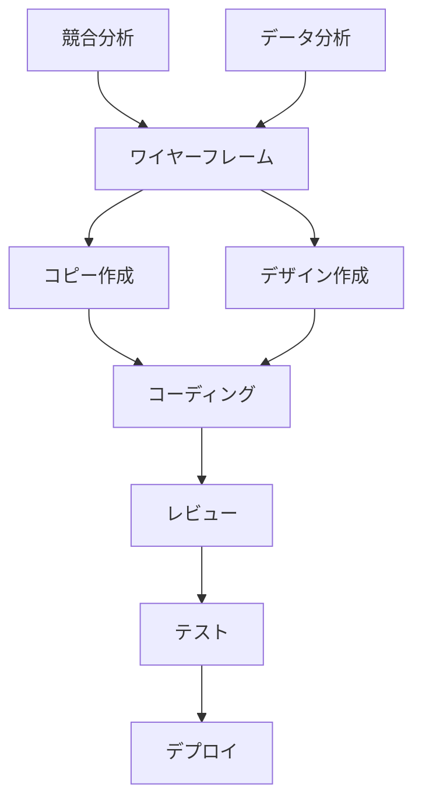

## はじめに：なぜタスクが終わらないのか

「やることは分かっているのに進まない」
「気づけば締切直前で慌てている」
「毎日忙しいのに成果が出ている気がしない」

こんな経験、ありませんか？私自身、数年前まで毎日残業しながらタスクに追われる日々でした。しかし、タスク管理の方法を根本から見直したことで、**労働時間を3割削減しながら成果は1.5倍に向上**させることができました。

この記事では、私が実践している「タスク分解の3階層メソッド」を完全解説します。このメソッドは、特別なツールも不要で、今日から実践できる内容です。読み終わる頃には、あなたのタスク管理が劇的に変わるはずです。

## タスク管理が失敗する3つの理由

まず、なぜ多くの人がタスク管理で挫折するのか、原因を整理しましょう。

### 1. タスクの粒度が不適切

「資料を作成する」「プロジェクトを進める」といった**大きすぎるタスク**では、何から手をつければいいか分からず、結果的に先延ばしになります。

### 2. 優先順位が曖昧

すべてが「重要」に見えてしまい、結局「やりやすいもの」「締切が近いもの」から手をつけてしまう。戦略的な優先順位付けができていません。

### 3. 見積もり時間が不正確

タスクにかかる時間を過小評価し、スケジュールが破綻。「なんとなく1時間でできそう」という感覚的な見積もりでは、計画通りに進みません。

これらの問題を解決するのが、次にご紹介する「3階層メソッド」です。

## タスク分解の3階層メソッドとは

このメソッドは、すべてのタスクを**3つの階層**に分解して管理する手法です。

```
【第1階層】プロジェクト層（全体像）
    ↓
【第2階層】タスク層（実行単位）
    ↓
【第3階層】アクション層（具体的作業）
```

それぞれの階層について、詳しく見ていきましょう。

## 第1階層：プロジェクト層の設計

### プロジェクトとは何か

プロジェクト層では、**複数のタスクから成る大きな目標**を定義します。

**良い例：**
- 新規サービスのLP制作
- 第3四半期の営業戦略立案
- チーム育成プログラムの構築

**悪い例（具体性が足りない）：**
- 仕事を進める
- 頑張る
- 改善する

### プロジェクトの設定ルール

1. **明確なゴールがある**：何をもって完了とするか定義する
2. **期限が設定できる**：無期限のプロジェクトは存在しない
3. **複数のタスクで構成される**：単一タスクはプロジェクトではない

### 実践例：プロジェクトの設定

```markdown
プロジェクト名: 新規採用ページのリニューアル
ゴール: 応募率を現状の1.5倍にする採用ページを公開
期限: 2024年3月末
成功指標: 月間応募数20件以上
```

このように、プロジェクト層では**「何を」「いつまでに」「どの水準で」**達成するかを明確にします。

## 第2階層：タスク層の分解

### タスクの適切な粒度

プロジェクトを、**2〜4時間で完了できる単位**にタスク分解します。これより大きいと進捗が見えにくく、小さすぎると管理コストが増えます。

### 分解の実践例

**プロジェクト：** 新規採用ページのリニューアル

**タスクへの分解：**

1. 競合サイト5社の採用ページ分析（3時間）
2. 現状の応募者データ分析と課題抽出（2時間）
3. 新ページのワイヤーフレーム作成（4時間）
4. コピーライティング（初稿）（3時間）
5. デザインモックアップ作成（4時間）
6. コーディング実装（4時間）
7. 社内レビューと修正（2時間）
8. テスト環境での動作確認（2時間）
9. 本番環境へのデプロイ（1時間）

各タスクに**見積もり時間**を設定することで、全体のスケジューリングが可能になります。

### タスクの依存関係を明確にする

タスクには順序があります。「1→2→3」のように順番に進めるべきもの、並行して進められるものを整理しましょう。



## 第3階層：アクション層の具体化

### アクションとは「今すぐできる最小単位」

タスクをさらに、**15〜30分で完了する具体的なアクション**に分解します。

**タスク例：** 競合サイト5社の採用ページ分析（3時間）

**アクションへの分解：**

```markdown
□ 分析対象の競合5社をリストアップ（5分）
□ 分析項目のチェックリストを作成（10分）
□ A社の採用ページをスクリーンショット保存（5分）
□ A社のページ構成・訴求内容を記録（20分）
□ B社の採用ページをスクリーンショット保存（5分）
□ B社のページ構成・訴求内容を記録（20分）
...（C社、D社、E社も同様）
□ 5社の共通点・差別化ポイントをまとめる（30分）
□ 自社への示唆を3つ以上抽出（20分）
```

### なぜアクション層まで分解するのか

1. **着手の心理的ハードルが下がる**：「5分でできる」なら今すぐ始められる
2. **進捗が可視化される**：チェックボックスを消す達成感がモチベーションに
3. **中断・再開が容易**：どこまで進んだか一目瞭然

## 3階層メソッドの運用方法

### ツールの選び方

特別なツールは不要です。以下のいずれかで十分です：

**紙・手帳派：**
- A4用紙を3つに折って、各階層を書き出す
- 付箋を使って階層ごとに色分け

**デジタル派：**
- Notion：データベース機能で階層管理が得意
- Trello：ボードでプロジェクト、カードでタスク・アクション
- Todoist：タスク管理に特化、階層化しやすい
- Excel/Google Sheets：シンプルで自由度が高い

**私のおすすめテンプレート（Notion）：**

```
📁 プロジェクト一覧
  └─ 📋 [プロジェクト名]
      ├─ ゴール: xxx
      ├─ 期限: xxxx/xx/xx
      ├─ 進捗: 40%
      └─ タスク一覧
          ├─ ✅ [完了したタスク]
          ├─ 🔄 [進行中のタスク]
          │   └─ アクション
          │       ├─ ✅ [完了アクション]
          │       ├─ □ [未着手アクション]
          └─ □ [未着手タスク]
```

### 週次・日次のルーティン

**日曜夜（週次レビュー）：**
1. プロジェクト層を見直し、優先度を再確認
2. 来週取り組むタスクを3〜5個選定
3. 各タスクをアクション層まで分解

**毎朝（日次計画）：**
1. 今日実行するアクション5〜10個をリストアップ
2. 所要時間の合計が実働時間の70%程度になるよう調整
3. 最重要アクションを午前中に配置

**毎夕（日次レビュー）：**
1. 完了したアクションをチェック
2. 未完了アクションは翌日に繰り越すか、見積もりを見直す
3. 明日の計画を微調整

## 実践者の成功事例

### ケース1：エンジニアAさん（29歳）

**導入前：** 複数プロジェクトを抱え、常に「何をやるべきか」迷い、残業月40時間

**導入後：**
- 全プロジェクトを3階層で整理
- 毎朝5分で今日やることが明確に
- 残業月10時間に削減、コードの品質も向上

**Aさんのコメント：**
「タスクが細かく分解されているので、『ちょっとした隙間時間』を有効活用できるようになりました。15分あれば1アクション完了できるので、待ち時間も無駄になりません」

### ケース2：マーケターBさん（34歳）

**導入前：** 大きな企画は後回しにして、小さなタスクばかり処理。重要プロジェクトが進まない

**導入後：**
- プロジェクト層で「重要だが緊急でない」タスクを可視化
- アクション層まで分解することで、大きな企画も着手可能に
- 戦略的な仕事の比率が2倍に

**Bさんのコメント：**
「『資料作成』という漠然としたタスクを、10個のアクションに分けたら、急に現実的に感じました。『目次を作る』だけなら10分でできるので、すぐ取りかかれます」

## よくある質問と回答

### Q1: すべてのタスクを3階層にしなきゃダメ？

A: いいえ。**重要度・複雑度が高いもの**だけで十分です。

- メールチェック、定例会議など日常的なタスク→そのまま
- 新規プロジェクト、初めての業務、重要案件→3階層で分解

### Q2: 分解に時間がかかりすぎる

A: 最初は時間がかかりますが、慣れれば1プロジェクト10分程度です。また、分解にかける時間は**後の効率化で十分回収**できます。

目安：
- プロジェクト設定：5分
- タスク分解：3分
- アクション分解：2分（タスクごと）

### Q3: 計画通りに進まないときは？

A: 計画は**修正するためにある**ものです。

- 見積もりが甘かった→次回の参考データとして記録
- 想定外の作業が発生→新しいアクションを追加
- 優先度が変わった→階層を見直して再計画

完璧を目指さず、**継続的に改善**する姿勢が大切です。

## まとめ：今日から始める3つのステップ

タスク分解の3階層メソッドは、あなたの仕事を劇的に効率化します。

**今日から始める3ステップ：**

### ステップ1：プロジェクトを1つ選ぶ
- 今週中に進めたいプロジェクトを1つ選びましょう
- ゴールと期限を明確に書き出します

### ステップ2：タスクに分解する
- そのプロジェクトを、2〜4時間でできる単位に分割
- 5〜10個のタスクになるのが理想的

### ステップ3：最初のタスクをアクションに
- 最も優先度の高いタスク1つを選び、アクション層まで分解
- 今日できる最初のアクションを1つ実行する

**重要なのは完璧さではなく、まず始めることです。**

このメソッドを1週間実践すれば、タスク管理の感覚が変わります。1ヶ月続ければ、あなたの仕事の質とスピードが確実に向上しているはずです。

明日の朝、出社したら（あるいはPCを開いたら）、まず5分だけこの方法を試してみてください。その5分が、あなた