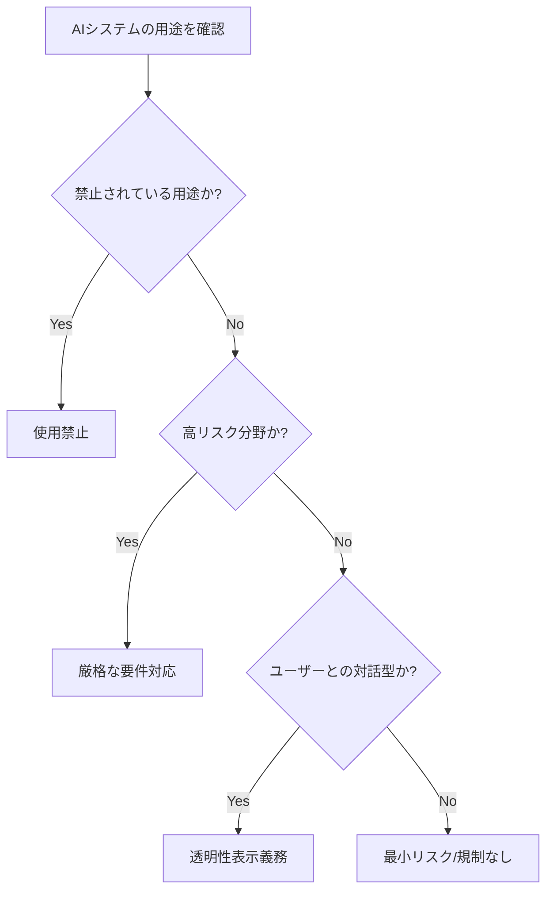

# はじめに

2024年8月、EUのAI規制法（EU AI Act）が正式に施行され、世界中の開発者やビジネスに大きな影響を与え始めています。この法律は世界初の包括的なAI規制として注目されており、日本企業や個人開発者であっても、EUユーザー向けにサービスを提供する場合は対応が必要になります。

本記事では、以下の内容を解説します：

- **EU AI Actの概要と主要ポイント**
- **開発者が具体的に対応すべきこと**
- **日本企業・個人開発者への影響**
- **今後のグローバルな規制動向**

この記事を読むことで、AI開発における法的リスクを理解し、コンプライアンス対応の第一歩を踏み出せます。

---

## EU AI Actとは何か

### 法律の背景と目的

EU AI Act（正式名称：Artificial Intelligence Act）は、2021年に欧州委員会が提案し、2024年に施行されたAI技術の包括的な規制法です。GDPRに続く重要な法規制として位置づけられています。

主な目的は以下の3つです：

1. **基本的人権の保護**：AIによる差別や不当な監視を防ぐ
2. **安全性の確保**：高リスクなAIシステムの品質基準を設定
3. **イノベーションの促進**：明確なルールで健全な開発環境を整備

### リスクベースアプローチ

EU AI Actの特徴は「リスクベースアプローチ」です。AIシステムをリスクレベルに応じて4段階に分類します：

| リスクレベル | 例 | 規制内容 |
|------------|-----|---------|
| **禁止** | 社会信用スコアリング、リアルタイム顔認証（一部例外あり） | 使用禁止 |
| **高リスク** | 雇用判断AI、信用スコアリング、医療診断AI | 厳格な要件（透明性、データ品質、人間の監視など） |
| **限定リスク** | チャットボット、ディープフェイク生成 | 透明性義務（AI利用の明示） |
| **最小リスク** | AIを使ったゲーム、スパムフィルター | 規制なし（推奨事項のみ） |

---

## 開発者が対応すべき具体的なポイント

### 1. 自社のAIシステムのリスク分類

まず、開発しているAIシステムがどのリスクカテゴリーに該当するかを判定します。

**判定フローの例：**



**高リスクAIの例：**
- 採用管理システムで応募者をスクリーニングするAI
- 融資判断を支援するAI
- 自動運転システム
- 遠隔生体認証システム

### 2. 技術文書の整備

高リスクAIシステムを開発する場合、以下の文書化が必須です：

```markdown
## 必要な技術文書チェックリスト

- [ ] AIシステムの詳細な説明（アーキテクチャ、アルゴリズム）
- [ ] データセットの説明
  - データソース
  - データ収集方法
  - バイアス対策
- [ ] リスク管理システムの文書
- [ ] テスト結果と精度評価
- [ ] 人間の監視（Human Oversight）の仕組み
- [ ] サイバーセキュリティ対策
```

### 3. データガバナンスの強化

AI Actではデータ品質に関する要件が明確に定められています。

**実装例（Pythonでのデータ品質チェック）：**

```python
import pandas as pd
from typing import Dict, List

class DataQualityChecker:
    """EU AI Act準拠のデータ品質チェッカー"""
    
    def __init__(self, data: pd.DataFrame):
        self.data = data
        self.quality_report: Dict = {}
    
    def check_completeness(self) -> float:
        """データの完全性チェック"""
        total_cells = self.data.size
        missing_cells = self.data.isna().sum().sum()
        completeness = (total_cells - missing_cells) / total_cells
        self.quality_report['completeness'] = completeness
        return completeness
    
    def check_bias_indicators(self, protected_attributes: List[str]) -> Dict:
        """保護属性のバランスチェック"""
        bias_report = {}
        for attr in protected_attributes:
            if attr in self.data.columns:
                distribution = self.data[attr].value_counts(normalize=True)
                bias_report[attr] = distribution.to_dict()
        self.quality_report['bias_indicators'] = bias_report
        return bias_report
    
    def generate_report(self) -> Dict:
        """品質レポートの生成"""
        return {
            'total_records': len(self.data),
            'completeness': self.quality_report.get('completeness'),
            'bias_indicators': self.quality_report.get('bias_indicators'),
            'timestamp': pd.Timestamp.now().isoformat()
        }

# 使用例
df = pd.DataFrame({
    'age': [25, 30, None, 45, 50],
    'gender': ['M', 'F', 'M', 'F', 'M'],
    'score': [85, 90, 88, None, 92]
})

checker = DataQualityChecker(df)
print(f"データ完全性: {checker.check_completeness():.2%}")
checker.check_bias_indicators(['gender'])
print(checker.generate_report())
```

### 4. 透明性表示の実装

限定リスク以上のAIシステムでは、ユーザーに対してAI利用を明示する必要があります。

**Webアプリケーションでの実装例：**

```html
<!-- AIチャットボットの透明性表示 -->
<div class="ai-disclosure" role="alert">
  <svg class="icon" aria-hidden="true">
    <use xlink:href="#robot-icon"></use>
  </svg>
  <p>
    このチャットはAI（人工知能）によって応答しています。
    <a href="/ai-policy">AIの使用方法について詳しく見る</a>
  </p>
</div>

<style>
.ai-disclosure {
  background-color: #f0f8ff;
  border-left: 4px solid #4a90e2;
  padding: 12px 16px;
  margin-bottom: 20px;
  display: flex;
  align-items: center;
  gap: 12px;
}
</style>
```

---

## 日本企業・個人開発者への影響

### EUユーザーへのサービス提供

EU AI Actは「域外適用」の原則を採用しています。これはGDPRと同様、以下の場合に適用されます：

- EUに拠点があるユーザーにAIサービスを提供する場合
- EUにいる人々の行動を監視・分析する場合

**影響を受ける可能性があるケース：**

```
✅ SaaSサービスをグローバル展開している
✅ オープンソースのAIツールを公開している
✅ APIサービスとして機械学習モデルを提供している
✅ EU企業と共同でAI開発を行っている
```

### 対応しない場合のリスク

違反した場合の罰金は非常に高額です：

- 禁止行為違反：最大3,500万ユーロまたは世界売上高の7%
- 高リスクAI要件違反：最大1,500万ユーロまたは世界売上高の3%
- 情報提供義務違反：最大750万ユーロまたは世界売上高の1.5%

### 実務的な対応ステップ

**個人開発者向けの現実的なアプローチ：**

1. **リスク評価**（1-2週間）
   - 自分のプロダクトがどのカテゴリーに該当するか判定
   - EUユーザーの割合を確認

2. **最小限の対応**（2-4週間）
   - プライバシーポリシーにAI利用を明記
   - チャットボットなどに透明性表示を追加
   - データ処理の記録を開始

3. **専門家への相談**（必要に応じて）
   - 高リスクAIの場合は法律事務所に相談
   - コンプライアンス支援ツールの導入検討

---

## グローバルな規制動向

### 各国の動き

EU AI Actの施行により、他の国々でも規制整備が加速しています。

**主要国の状況（2024年12月時点）：**

| 国・地域 | 規制の状況 | 特徴 |
|---------|-----------|------|
| **米国** | バイデン政権が大統領令を発令（2023年10月） | 連邦政府機関のAI利用に関するガイドライン |
| **中国** | 生成AIに関する規制を施行（2023年8月） | コンテンツ規制と登録制度 |
| **日本** | AI戦略会議で議論中 | ソフトロー（自主規制）アプローチ |
| **英国** | セクター別アプローチを検討 | 既存規制機関による対応 |
| **カナダ** | AI・データ法案（Bill C-27）審議中 | リスクベースの枠組み |

### 日本の対応方針

日本政府は現時点で包括的な法規制ではなく、以下のアプローチを採用しています：

- **ガイドライン中心**：AI利用原則の策定
- **業界自主規制**：各業界団体による倫理規定
- **国際協調**：G7広島AIプロセスへの参画

ただし、EU AI Actの影響により、今後日本でも規制強化の可能性があります。

---

## 実践：コンプライアンスチェックツールの作成

開発者が自己チェックできる簡単なツールを作成してみましょう。

```python
from typing import List, Dict
from enum import Enum

class RiskLevel(Enum):
    PROHIBITED = "禁止"
    HIGH = "高リスク"
    LIMITED = "限定リスク"
    MINIMAL = "最小リスク"

class EUAIActChecker:
    """EU AI Act準拠チェッカー"""
    
    def __init__(self):
        self.high_risk_domains = [
            "雇用・人事管理",
            "教育・職業訓練",
            "信用評価",
            "法執行",
            "移民管理",
            "司法・民主的プロセス",
            "重要インフラ管理"
        ]
    
    def assess_risk(self, 
                   domain: str,
                   has_human_interaction: bool,
                   affects_legal_status: bool) -> Dict:
        """リスクレベルの評価"""
        
        # 禁止用途のチェック
        if "社会信用スコア" in domain or "無差別監視" in domain:
            return {
                "risk_level": RiskLevel.PROHIBITED,
                "compliance_required": "使用禁止",
                "action_items": ["このAIシステムはEU域内で使用できません"]
            }
        
        # 高リスクのチェック
        if domain in self.high_risk_domains or affects_legal_status:
            return {
                "risk_level": RiskLevel.HIGH,
                "compliance_required": "厳格",
                "action_items": [
                    "技術文書の作成",
                    "リスク管理システムの構築",
                    "データガバナンスの整備",
                    "ログ記録の実装",
                    "人間の監視メカニズム",
                    "適合性評価の実施"
                ]
            }
        
        # 限定リスクのチェック
        if has_human_interaction:
            return {
                "risk_level": RiskLevel.LIMITED,
                "compliance_required": "透明性",
                "action_items": [
                    "AI利用の明示",
                    "ユーザーへの通知",
                    "プライバシーポリシーの更新"
                ]
            }
        
        # 最小リスク
        return {
            "risk_level": RiskLevel.MINIMAL,
            "compliance_required": "なし（推奨事項のみ）",
            "action_items": [
                "ベストプラクティスの適用（任意）"
            ]
        }
    
    def generate_checklist(self, assessment: Dict) -> str:
        """チェックリストの生成"""
        output = f"\n=== EU AI Act コンプライアンスチェック