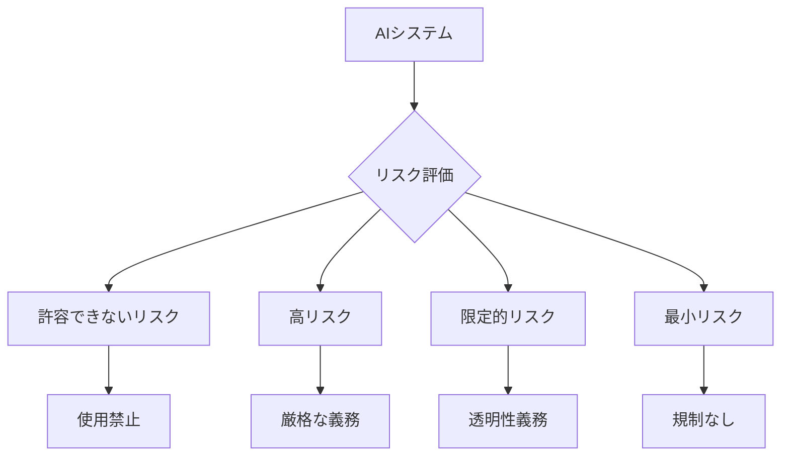

# はじめに

2024年は「AI規制元年」とも呼ばれ、世界各国でAIに関する法規制が急速に整備されています。特にEUのAI規制法（AI Act）が2024年8月に発効し、日本でもAI事業者ガイドラインの改定が進んでいます。

この記事では、**エンジニアやプロダクト開発者が実務で直面する可能性の高いAI規制の要点**を、技術的な観点から分かりやすく解説します。

:::message
この記事は2024年12月時点の情報に基づいています。法規制は変更される可能性があるため、最新情報は公式ソースをご確認ください。
:::

## なぜ今、AI規制が注目されているのか

### 背景にある3つの要因

1. **生成AIの急速な普及**
   - ChatGPT、Claude、Geminiなど、誰でも使えるAIツールが爆発的に増加
   - 企業の業務への組み込みが加速

2. **リスクの顕在化**
   - ディープフェイクによる詐欺・偽情報
   - AIによる差別的判断（採用、融資など）
   - 著作権侵害の懸念

3. **国際的な規制の動き**
   - EUが世界に先駆けて包括的な法規制を制定
   - アメリカ、中国、日本もそれぞれの方針を策定

## ポイント1：EUのAI規制法（AI Act）の基本構造

### リスクベースアプローチとは

EU AI Actの最大の特徴は、**AIシステムのリスクレベルに応じて規制の強度を変える**という考え方です。



### 4つのリスクカテゴリー

| リスクレベル | 具体例 | 規制内容 |
|------------|--------|---------|
| **許容できないリスク** | 社会信用スコア、感情認識（教育・職場） | 使用禁止 |
| **高リスク** | 採用AI、信用スコアリング、医療診断AI | 厳格な事前審査・継続監視 |
| **限定的リスク** | チャットボット、ディープフェイク生成 | AI利用の明示義務 |
| **最小リスク** | AIフィルター、ゲームのNPC | 規制なし（自主的対応） |

### エンジニアが注意すべき実務ポイント

**高リスクAIを開発する場合の要件：**

```python
# 例：採用支援AIシステムを開発する場合の考慮事項

class HiringAISystem:
    def __init__(self):
        # 1. データガバナンス要件
        self.training_data_quality = {
            "bias_check": True,  # バイアスチェック必須
            "data_provenance": "documented",  # データ出所の文書化
            "representativeness": "verified"  # 代表性の検証
        }
        
        # 2. 透明性要件
        self.documentation = {
            "model_card": "required",  # モデルカード作成
            "risk_assessment": "required",  # リスク評価書
            "user_manual": "required"  # ユーザーマニュアル
        }
        
        # 3. 人間による監視
        self.human_oversight = {
            "final_decision": "human",  # 最終判断は人間
            "override_capability": True,  # 人間による上書き可能
            "explanation_available": True  # 判断理由の説明可能
        }
```

:::message alert
**域外適用に注意！**
EUのAI規制法は、EU域内でAIシステムを提供する場合、企業の所在地に関わらず適用されます。日本企業でもEU向けサービスを提供している場合は対象になります。
:::

## ポイント2：日本のAI事業者ガイドライン

### 総務省・経産省によるガイドラインの枠組み

日本では、EUのような法規制ではなく、まずは**ガイドライン**による自主的な取り組みを促進する方針です。

**10の原則（AI利活用ガイドラインより抜粋）：**

1. 適正利用の原則
2. 適正学習の原則
3. 連携の原則
4. 安全の原則
5. セキュリティの原則
6. プライバシーの原則
7. 尊厳・自律の原則
8. 公平性の原則
9. 透明性の原則
10. アカウンタビリティの原則

### 実装レベルでの対応例

**透明性の原則を実装する例：**

```typescript
// AIサービスのAPIレスポンスに説明性を持たせる例

interface AIResponse {
  result: string;
  confidence: number;
  
  // 透明性を確保するための情報
  metadata: {
    modelVersion: string;
    processedAt: Date;
    
    // 判断根拠の説明
    explanation: {
      mainFactors: string[];
      uncertaintyLevel: "low" | "medium" | "high";
      humanReviewRecommended: boolean;
    };
    
    // データソースの明示
    dataSources: {
      trainingDataPeriod: string;
      lastUpdated: Date;
      dataQualityScore: number;
    };
  };
}

// 使用例
const response: AIResponse = {
  result: "承認",
  confidence: 0.87,
  metadata: {
    modelVersion: "v2.3.1",
    processedAt: new Date(),
    explanation: {
      mainFactors: [
        "過去の取引履歴（70%）",
        "収入の安定性（20%）",
        "その他要因（10%）"
      ],
      uncertaintyLevel: "low",
      humanReviewRecommended: false
    },
    dataSources: {
      trainingDataPeriod: "2020-2024",
      lastUpdated: new Date("2024-11-01"),
      dataQualityScore: 0.92
    }
  }
};
```

### 著作権法の改正動向

2024年の著作権法改正議論では、**生成AIの学習データに関する論点**が注目されています。

**エンジニアが把握すべきポイント：**

- **学習段階**：非享受目的（AIに学習させるだけ）であれば原則として著作権侵害にならない（30条の4）
- **生成段階**：生成物が既存著作物に類似する場合は侵害リスクあり
- **今後の改正**：クリエイター保護の観点から、規制が強化される可能性

```python
# データセット構築時のベストプラクティス例

class TrainingDataManager:
    def __init__(self):
        self.data_registry = []
    
    def add_training_data(self, data, metadata):
        """
        学習データを追加する際に、著作権情報を記録
        """
        entry = {
            "data": data,
            "license": metadata.get("license"),  # ライセンス情報
            "source": metadata.get("source"),    # データソース
            "copyright_cleared": metadata.get("copyright_cleared", False),
            "usage_restrictions": metadata.get("restrictions", []),
            "added_at": datetime.now()
        }
        
        # ライセンスチェック
        if not self._validate_license(entry):
            raise ValueError("License validation failed")
        
        self.data_registry.append(entry)
        return entry
    
    def _validate_license(self, entry):
        """
        商用利用可能かチェック
        """
        allowed_licenses = ["MIT", "Apache-2.0", "CC-BY", "Public Domain"]
        return entry["license"] in allowed_licenses or entry["copyright_cleared"]
```

## ポイント3：実務で今すぐできる対応策

### 開発プロセスに組み込むべきチェックリスト

**1. プロジェクト開始時**

- [ ] AIシステムのリスクレベルを評価
- [ ] 適用される規制・ガイドラインを特定
- [ ] データガバナンス方針を文書化
- [ ] プライバシー影響評価（PIA）の実施判断

**2. 開発段階**

- [ ] バイアステストの実施
- [ ] モデルカードの作成
- [ ] 説明可能性の実装
- [ ] セキュリティテストの実施

**3. リリース前**

- [ ] 利用規約にAI使用の明記
- [ ] ユーザー向けドキュメントの整備
- [ ] 人間による監視体制の構築
- [ ] インシデント対応手順の策定

**4. 運用段階**

- [ ] 継続的なモニタリング
- [ ] ユーザーフィードバックの収集
- [ ] 定期的な再評価
- [ ] 規制アップデートの追跡

### モデルカードの作成例

```markdown
# モデルカード：顧客問い合わせ分類AI

## モデル概要
- **モデル名**: CustomerInquiryClassifier v1.2
- **開発日**: 2024年10月
- **用途**: カスタマーサポートの問い合わせ自動分類

## 想定される使用方法
- 顧客からのメール・チャットを自動分類
- 適切な担当部署へのルーティング支援
- **最終判断は人間が行う前提**

## 学習データ
- 2022-2024年の問い合わせデータ 50,000件
- 個人情報は匿名化済み
- 日本語のみ対応

## パフォーマンス指標
- 全体精度: 89%
- カテゴリー別精度:
  - 技術サポート: 92%
  - 請求関連: 87%
  - 一般問い合わせ: 88%

## 既知の制限事項
- 方言や若者言葉には精度が低下
- 複数カテゴリーにまたがる問い合わせは誤分類の可能性
- 新しい製品についての問い合わせは学習データに含まれない

## 倫理的考慮事項
- 特定の地域・年齢層に偏りがないかテスト済み
- 差別的な分類を行わないよう監視中

## 更新履歴
- v1.2 (2024/10): 精度向上のため再学習
- v1.1 (2024/07): バイアス軽減のためデータ追加
```

### 組織体制の整備

**推奨される役割分担：**

```
プロダクトチーム
├── AI倫理責任者（AI Ethics Officer）
│   └── 倫理的問題の監視・判断
├── データガバナンス担当
│   └── データ品質・コンプライアンス管理
├── 技術リード
│   └── 技術的実装・セキュリティ
└── 法務・コンプライアンス
    └── 規制対応・リスク管理
```

## よくある質問（FAQ）

### Q1: 小規模スタートアップでも対応が必要？

**A:** サービスの性質によります。高リスクに分類されるAI（採用支援、医療診断など）を扱う場合は、規模に関わらず対応が必要です。チャットボットなど限定的リスクのAIであれば、まずは透明性の確保（AI使用の明示）から始めましょう。

### Q2: オープンソースのAIモデルを使う場合は？

**A:** モデル自体のライセンスとは別に、**あなたのサービスとしての責任**は発生します。使用するモデルのバイアスや制限事項を理解し、適切な監視体制を構築する必要があります。

### Q3: 既存サービスへの影響は？

**A:** 2024年時点で稼働しているサービスも、規制の対象になる可能性があります。特にEU AI Actには経過措置期間がありますが、**2026年までに完全対応**が求められます。早めの対応計画策定をおすすめします。

## まとめ

### 押さえておくべき3つの要点

1. **リスクベースで考える**
   - すべてのAIが同じ規制を受けるわけではない
   - 自社のAIシステムがどのリスクレベルに該当するか評価が最優先

2. **透明性と説明可能性を設計段階から組み込む**
   - 後付けでの対応は困難でコストも高い
   - ユーザーへの説明責任を果たせる設計を

3. **継続的な対応が必要**
   - 規制は進化し続ける
   -