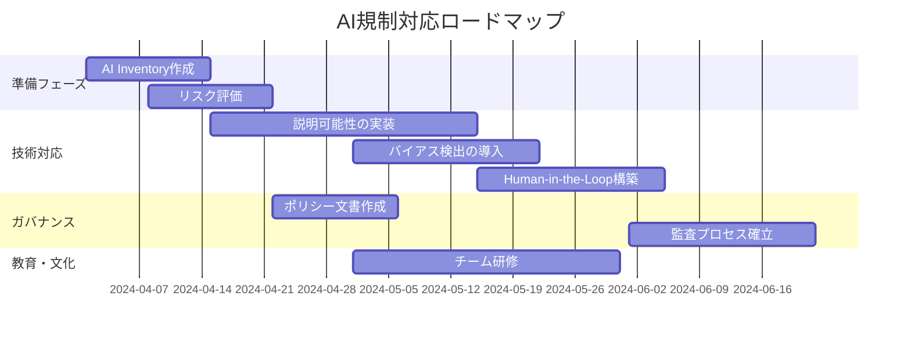

## はじめに：なぜ今、AI規制を理解する必要があるのか

2024年は「AI規制元年」とも呼ばれる転換点となりました。EUのAI規制法（AI Act）が正式に成立し、米国でもバイデン政権がAIに関する大統領令を発令。日本でも広島AIプロセスを通じた国際的な枠組み作りが進んでいます。

この記事では、**技術者の視点から実務にどう影響するか**に焦点を当て、主要な規制動向と具体的な対応策を解説します。法務部門だけの問題ではなく、AIシステムを開発・運用するエンジニア自身が理解すべき重要なトピックです。

**この記事で得られる知識：**
- 世界の主要AI規制の概要と適用範囲
- エンジニアが実務で直面する具体的な要求事項
- コンプライアンス対応のための技術的アプローチ
- チーム内で規制対応を進めるためのチェックリスト

## 主要なAI規制の全体像

### 1. EU AI規制法（AI Act）

2024年3月に欧州議会で可決されたEU AI規制法は、世界で最も包括的なAI規制として注目されています。

**リスクベースアプローチの採用**

AI ActはAIシステムを4つのリスクレベルに分類します：

| リスクレベル | 例 | 規制内容 |
|------------|-----|----------|
| 許容できないリスク | サブリミナル操作、社会的スコアリング | **使用禁止** |
| 高リスク | 採用AI、信用スコアリング、生体認証 | 厳格な要件（透明性、人間の監視、データガバナンス） |
| 限定的リスク | チャットボット | 透明性義務（AI利用の明示） |
| 最小リスク | スパムフィルター | 規制なし |

**適用範囲の広さ**

重要なのは、**EU域内で使用されるAIシステムすべてが対象**という点です。日本企業でもEU市場向けにサービス提供している場合、対応が必須となります。

### 2. 米国のアプローチ

米国は連邦レベルでの包括的規制ではなく、**分野別・リスク別の規制**を進めています。

**主要な動き：**
- **大統領令14110号**（2023年10月）：連邦政府機関のAI利用ガイドライン
- **アルゴリズム説明責任法案**：高リスクAIシステムの影響評価義務
- **州レベルの規制**：カリフォルニア州、ニューヨーク州などが独自に雇用AIの規制を導入

### 3. 日本の動向

日本は**ソフトロー（任意のガイドライン）**を中心としたアプローチを採用しています。

**重要な文書：**
- **広島AIプロセス**（G7）：生成AIの国際的な行動規範
- **AI事業者ガイドライン**（総務省・経産省）：開発・運用の指針
- **個人情報保護法の改正検討**：AIプロファイリングへの対応

## エンジニアが直面する実務要件

規制の全体像を理解したところで、実際の開発・運用で何をすべきかを見ていきましょう。

### 要件1：透明性・説明可能性の確保

**何が求められるか：**
AIの判断プロセスを説明できること、特に高リスク領域（採用、融資、医療など）では必須です。

**技術的アプローチ：**

```python
# SHAP（SHapley Additive exPlanations）を使った説明可能性の実装例
import shap
import xgboost as xgb

# モデルのトレーニング
model = xgb.XGBClassifier()
model.fit(X_train, y_train)

# SHAP値の計算
explainer = shap.TreeExplainer(model)
shap_values = explainer.shap_values(X_test)

# 個別予測の説明を可視化
shap.force_plot(
    explainer.expected_value,
    shap_values[0],
    X_test.iloc[0],
    matplotlib=True
)

# 特徴量の重要度を出力
shap.summary_plot(shap_values, X_test)
```

**実務での活用：**
- ユーザー向け説明UI：「この判断は〇〇の要素が××%影響しています」
- 監査ログとしてSHAP値を保存
- 異常な予測を検出するためのモニタリング

### 要件2：人間によるレビュー機能（Human-in-the-Loop）

**実装パターン：**

```typescript
// AIの判断に人間のレビューを組み込む実装例
interface AIDecision {
  decision: 'approve' | 'reject' | 'review';
  confidence: number;
  reasoning: string;
}

interface ReviewWorkflow {
  aiDecision: AIDecision;
  humanReview?: {
    reviewer: string;
    decision: 'approve' | 'reject';
    timestamp: Date;
    notes: string;
  };
}

class AIDecisionSystem {
  private readonly CONFIDENCE_THRESHOLD = 0.85;
  
  async processApplication(data: ApplicationData): Promise<ReviewWorkflow> {
    // AIによる判断
    const aiDecision = await this.aiModel.predict(data);
    
    // 信頼度が低い、または高リスクの場合は人間のレビューへ
    if (
      aiDecision.confidence < this.CONFIDENCE_THRESHOLD ||
      this.isHighRiskCategory(data)
    ) {
      return {
        aiDecision: { ...aiDecision, decision: 'review' },
        // レビュー待ちキューに追加
      };
    }
    
    return { aiDecision };
  }
  
  private isHighRiskCategory(data: ApplicationData): boolean {
    // 高リスク判定のロジック（金額、重要度など）
    return data.amount > 1000000 || data.category === 'critical';
  }
}
```

### 要件3：バイアス検出と公平性の確保

**具体的なチェック項目：**

```python
# Fairlearn を使った公平性評価の例
from fairlearn.metrics import MetricFrame, selection_rate
from sklearn.metrics import accuracy_score

# 保護属性（性別、人種など）ごとの評価
metric_frame = MetricFrame(
    metrics={
        'accuracy': accuracy_score,
        'selection_rate': selection_rate
    },
    y_true=y_test,
    y_pred=y_pred,
    sensitive_features=sensitive_features['gender']
)

# 結果の表示
print(metric_frame.by_group)

# 格差の確認
print(f"Accuracy差: {metric_frame.difference()['accuracy']}")
print(f"Selection rate比: {metric_frame.ratio()['selection_rate']}")
```

**実務での運用：**
1. **開発段階**：訓練データのバイアス分析
2. **テスト段階**：複数の保護属性で公平性メトリクスを評価
3. **運用段階**：定期的なモニタリングと再評価

### 要件4：データガバナンスとプライバシー

**実装すべき管理体制：**

```yaml
# データガバナンスの設定例（YAML形式でのポリシー定義）
data_governance:
  training_data:
    retention_period: "3years"
    anonymization: "required"
    consent_tracking: true
    deletion_policy:
      user_request: "30days"
      regulatory: "comply_with_gdpr"
  
  model_artifacts:
    versioning: true
    audit_log: "enabled"
    access_control:
      - role: "data_scientist"
        permissions: ["read", "write"]
      - role: "auditor"
        permissions: ["read"]
  
  inference_data:
    logging: "required"
    retention: "1year"
    encryption: "at_rest_and_in_transit"
```

**チェックリスト：**
- [ ] 個人データの最小化原則を適用しているか
- [ ] データ主体の権利（アクセス、削除、訂正）に対応できるか
- [ ] データの出所を追跡できるか（Data Lineage）
- [ ] クロスボーダーデータ転送の規制に準拠しているか

## 組織での規制対応の進め方

### ステップ1：現状評価（AI Inventory）

まず、社内で使用・開発しているAIシステムの棚卸しを行います。

**評価テンプレート：**

| 項目 | 内容 | リスク評価 |
|------|------|-----------|
| システム名 | 与信審査AI | 高リスク |
| 用途 | ローン申請の自動審査 | EU AI Act該当 |
| 使用データ | 年齢、収入、信用履歴 | 個人情報あり |
| 意思決定の自動化度 | 80%（一部人間がレビュー） | 要改善 |
| 説明可能性 | ブラックボックスモデル | 要対応 |
| 現在の対策 | なし | 緊急 |

### ステップ2：優先順位付け

すべてを一度に対応するのは現実的ではありません。以下の基準で優先順位をつけましょう：

**高優先度：**
1. EU市場で使用している高リスクAI
2. 雇用・人事に関わるAI
3. 金融・医療など規制業界のAI

**中優先度：**
4. 顧客対応AI（チャットボットなど）
5. 社内業務効率化AI

**低優先度：**
6. 推薦システム（eコマースなど）
7. 最小リスクのAI

### ステップ3：実装ロードマップ

**3ヶ月計画の例：**



### ステップ4：継続的モニタリング

規制対応は一度やれば終わりではありません。

**定期チェック項目：**
- 月次：モデルのパフォーマンスと公平性メトリクス
- 四半期：データガバナンスの監査
- 年次：規制環境の変化と対応状況のレビュー

## 実践的なツールとリソース

### オープンソースツール

**1. 説明可能性：**
- **SHAP**: 最も広く使われる説明可能性ライブラリ
- **LIME**: ローカル説明に特化
- **InterpretML**: Microsoftが開発するガラスボックスモデル

**2. 公平性：**
- **Fairlearn**: バイアス検出と緩和
- **AI Fairness 360**: IBMのツールキット
- **What-If Tool**: Google製のインタラクティブツール

**3. モデル管理：**
- **MLflow**: 実験管理とモデルレジストリ
- **DVC**: データバージョン管理
- **Kubeflow**: エンドツーエンドのMLOpsプラットフォーム

### ドキュメントテンプレート

**モデルカード（Model Card）の例：**

```markdown
# モデルカード：ローン審査AI v2.1

## モデル詳細
- **開発者**: XYZ社 データサイエンスチーム
- **モデルタイプ**: XGBoost分類器
- **バージョン**: 2.1
- **トレーニング日**: 2024年3月15日

## 意図された用途
- **主目的**: 個人向けローン申請の初期審査
- **想定ユーザー**: 審査担当者（最終判断は人間が行う）
- **適用外**: 企業向けローン、100万円超の申請

## パフォーマンス
- **全体精度**: 87.5%
- **適合率**: 82.3%
- **再現率**: 84.1%

## 公平性評価
| 保護属性 | 承認率の差 | 許容範囲内 |
|---------|-----------|----------|
| 性別 | 2.1% | ✓ |
| 年齢層 | 3.8% | ✓ |
| 地域 | 1.5