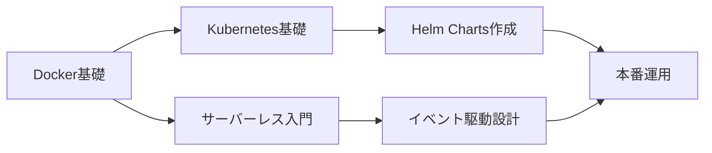

## はじめに：変化の激しい技術業界で生き残るために

2024年も既に多くの技術トレンドが生まれ、消えていきました。AI技術の爆発的な進化、クラウドネイティブ技術の成熟、そしてWeb3やメタバースといった概念の再定義。このような変化の激しい時代において、エンジニアは「何を学ぶべきか」という問いに常に直面しています。

この記事では、2024年の技術トレンドを振り返りながら、**実務で本当に役立つスキルセット**にフォーカスして解説します。単なる流行追いではなく、長期的なキャリア形成に資する学習戦略を提案します。

**この記事で得られること：**
- 2024年の主要技術トレンドの整理
- 各トレンドにおける実務レベルでの活用例
- 優先順位をつけた学習ロードマップ
- 実際に学習を始めるための具体的リソース

## 2024年の主要技術トレンド

### 1. 生成AI時代のエンジニアリング

2023年のChatGPTブームから1年以上が経過し、生成AIは「実験段階」から「実用段階」へと完全に移行しました。

#### 実務での具体的な活用シーン

**コード生成・補完の日常化**
GitHub CopilotやCursor、Amazon CodeWhispererなどのAIコーディングアシスタントは、もはやエンジニアの標準装備となっています。

```python
# 例：AIアシスタントを活用したAPI開発
# プロンプト: "FastAPIでユーザー認証機能を持つREST APIを作成"

from fastapi import FastAPI, Depends, HTTPException, status
from fastapi.security import OAuth2PasswordBearer, OAuth2PasswordRequestForm
from pydantic import BaseModel
from datetime import datetime, timedelta
from jose import JWTError, jwt
from passlib.context import CryptContext

# AIが生成したボイラープレートコードをベースに、
# ビジネスロジックに集中できる
app = FastAPI()
pwd_context = CryptContext(schemes=["bcrypt"], deprecated="auto")
oauth2_scheme = OAuth2PasswordBearer(tokenUrl="token")

# 以下、認証ロジックの実装...
```

**学ぶべきスキル：**
- **プロンプトエンジニアリング**: AIから最適な出力を引き出す技術
- **AIコードレビュー**: AI生成コードの品質判断・改善能力
- **RAG（Retrieval-Augmented Generation）**: 自社データを活用したAI構築

#### 実践的な学習ステップ

1. **Week 1-2**: GitHub Copilotを導入し、日常開発で使う
2. **Week 3-4**: LangChainでシンプルなチャットボット構築
3. **Week 5-8**: 社内ドキュメントを使ったRAGシステムの実装

### 2. クラウドネイティブ技術の成熟

Kubernetesが「難しい技術」から「標準インフラ」になり、サーバーレスアーキテクチャも確立されました。

#### 実務で求められる具体的スキル

**Infrastructure as Code (IaC)の必須化**

```hcl
# Terraformの例：ECSクラスタの定義
resource "aws_ecs_cluster" "main" {
  name = "production-cluster"
  
  setting {
    name  = "containerInsights"
    value = "enabled"
  }
}

resource "aws_ecs_service" "app" {
  name            = "app-service"
  cluster         = aws_ecs_cluster.main.id
  task_definition = aws_ecs_task_definition.app.arn
  desired_count   = 3
  
  load_balancer {
    target_group_arn = aws_lb_target_group.app.arn
    container_name   = "app"
    container_port   = 8080
  }
}
```

**コスト最適化の重要性**
クラウド費用の爆発的増加が問題となり、FinOps（Financial Operations）の知識が必須に。

**学ぶべきスキル：**
- **Kubernetes基礎**: Pod、Service、Deploymentの理解
- **サーバーレス設計**: Lambda/Cloud Functionsでのイベント駆動アーキテクチャ
- **監視・オブザーバビリティ**: Prometheus、Grafana、OpenTelemetry
- **コスト最適化**: リソース使用量の分析と最適化

#### 実践的な学習ロードマップ



1. **Month 1**: Dockerで既存アプリをコンテナ化
2. **Month 2**: Minikubeでローカル環境構築
3. **Month 3**: AWS EKS/GKEで実際にデプロイ
4. **Month 4**: 監視システム導入とアラート設定

### 3. フロントエンド技術の進化

React Server Components、Next.js 14のApp Router、そしてRustベースのツールチェーンなど、フロントエンド領域も大きく変化しています。

#### React Server Componentsの実用化

```typescript
// app/page.tsx (Next.js 14 App Router)
// サーバーコンポーネント（デフォルト）
async function getUserData(id: string) {
  const res = await fetch(`https://api.example.com/users/${id}`, {
    cache: 'no-store' // 動的データ
  });
  return res.json();
}

export default async function UserProfile({ 
  params 
}: { 
  params: { id: string } 
}) {
  const user = await getUserData(params.id);
  
  return (
    <div>
      <h1>{user.name}</h1>
      <UserInteraction userId={user.id} /> {/* クライアントコンポーネント */}
    </div>
  );
}
```

**学ぶべきスキル：**
- **Next.js App Router**: サーバーコンポーネントとクライアントコンポーネントの使い分け
- **TypeScript高度な型システム**: Generics、Conditional Typesの実践活用
- **パフォーマンス最適化**: Core Web Vitalsの改善手法
- **モダンビルドツール**: Vite、Turbopack、Biomeなど

### 4. セキュリティファースト開発

サイバー攻撃の高度化により、「セキュリティは専門チームの仕事」ではなくなりました。

#### 開発者が実装すべきセキュリティ対策

**依存関係の脆弱性管理**

```yaml
# GitHub Actionsでの自動脆弱性チェック
name: Security Scan
on: [push, pull_request]

jobs:
  security:
    runs-on: ubuntu-latest
    steps:
      - uses: actions/checkout@v3
      
      - name: Run Trivy vulnerability scanner
        uses: aquasecurity/trivy-action@master
        with:
          scan-type: 'fs'
          scan-ref: '.'
          severity: 'CRITICAL,HIGH'
          
      - name: Run Snyk Security Scan
        uses: snyk/actions/node@master
        env:
          SNYK_TOKEN: ${{ secrets.SNYK_TOKEN }}
```

**学ぶべきスキル：**
- **OWASP Top 10**: Webアプリケーションの主要脆弱性
- **認証・認可**: OAuth 2.0、OpenID Connect、JWTの正しい実装
- **シークレット管理**: AWS Secrets Manager、HashiCorp Vaultの活用
- **セキュアコーディング**: 入力検証、SQLインジェクション対策など

## 優先順位付き学習戦略

すべてを同時に学ぶことは不可能です。現在の役割と今後のキャリアパスに応じて、優先順位をつけましょう。

### バックエンドエンジニアの場合

**優先度：高**
1. 生成AI（RAG、プロンプトエンジニアリング）
2. Kubernetes + IaC（Terraform/Pulumi）
3. セキュリティ基礎（OWASP Top 10）

**優先度：中**
4. 監視・オブザーバビリティ
5. イベント駆動アーキテクチャ

**優先度：低（必要に応じて）**
6. フロントエンド技術の基礎理解

### フロントエンドエンジニアの場合

**優先度：高**
1. React Server Components / Next.js App Router
2. TypeScript高度な活用
3. パフォーマンス最適化（Core Web Vitals）

**優先度：中**
4. 生成AI（コパイロット活用、UI生成）
5. セキュリティ基礎（XSS、CSRF対策）

**優先度：低（必要に応じて）**
6. バックエンドAPIの理解

### フルスタックエンジニアの場合

バランス型の学習が求められますが、**深さより広さ**を意識：

1. 生成AI（基礎的な活用）
2. Kubernetesまたはサーバーレス（どちらか選択）
3. Next.js App Router
4. セキュリティ基礎全般
5. 監視・デバッグスキル

## 効率的な学習方法

### 1. アウトプット駆動学習

**個人プロジェクトでの実践例：**

```
プロジェクト案: 社内ナレッジ検索システム
- RAGでSlackログを検索可能に
- Next.js 14でフロントエンド構築
- Kubernetesでデプロイ
- Prometheusで監視
- GitHub Actionsでセキュリティスキャン

→ 5つのトレンド技術を1つのプロジェクトで学習
```

### 2. コミュニティ活用

- **X（旧Twitter）**: 技術トレンドのキャッチアップ
- **Zenn/Qiita**: 日本語での深い技術解説
- **GitHub**: オープンソースコードリーディング
- **Discord/Slack**: 技術コミュニティでの質問・議論

### 3. 時間配分の目安

```
週10時間の学習時間がある場合：
- 新技術のキャッチアップ: 2時間（記事・動画）
- ハンズオン実践: 6時間（実際に手を動かす）
- アウトプット: 2時間（ブログ執筆、OSS貢献）
```

## 学習リソース

### 生成AI関連
- **公式ドキュメント**: OpenAI API、Anthropic Claude
- **コース**: DeepLearning.AI「ChatGPT Prompt Engineering for Developers」
- **書籍**: 「大規模言語モデルは新たな知能か」

### クラウド・インフラ
- **ハンズオン**: AWS Well-Architected Labs
- **資格**: AWS SAA、CKA（Certified Kubernetes Administrator）
- **コミュニティ**: CNCF Slack、Cloud Native Community Groups

### フロントエンド
- **公式**: Next.js Learn、React公式ドキュメント
- **動画**: Vercelの公式YouTube
- **書籍**: 「りあクト！ TypeScriptで始めるつらくないReact開発」

### セキュリティ
- **無料コース**: PortSwigger Web Security Academy
- **ハンズオン**: OWASP Juice Shop（脆弱性体験環境）
- **資格**: CompTIA Security+、CEH

## まとめ：2024年エンジニアの学習指針

2024年の技術トレンドを踏まえた学習戦略をまとめます。

### 核心的なポイント

1. **生成AIは「ツール」として使いこなす**
   - コーディングアシスタントの日常化
   - RAGでの業務効率化
   - ただし、基礎力は引き続き重要

2. **インフラ知識はもはや「全員必須」**
   - コンテナ技術の基礎理解
   - IaCでのインフラ管理
   - コスト意識を持った設計

3. **セキュリティは「後回しにできない」**
   - 開発初期からのセキュリティ考慮
   - 自動化されたセキュリティチェック
   - 継続的な脆弱性管理

4. **学習は「狭く深く」より「戦略的に」**
   - 自分のキャリアパスに沿った優先順位
   - トレンドに振り回されない軸
   - アウトプット前提の学習

### 明日から始められるアクション

- [ ] GitHub Copilotを有効化し、1週間使ってみる
- [ ] 既存プロジェクトをDockerコンテナ化する
- [ ] OWASP Top 10を読み、1つの脆弱性を深掘りする
- [ ] 学んだことをZ