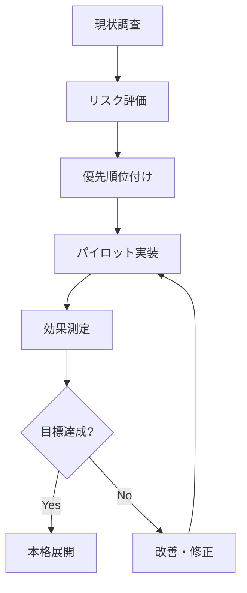

## はじめに

生成AIの急速な普及に伴い、世界各国で規制の枠組み作りが加速しています。開発者やエンジニアにとって、これらの規制動向を理解することは、もはや「知っておいた方が良い」レベルではなく、**必須のリスク管理**となっています。

本記事では、2024年現在の主要な生成AI規制の動きを整理し、実務でどのような影響があるのか、どう対応すべきかを具体的に解説します。特に以下の方に役立つ内容です:

- 生成AIを活用したサービス開発に携わるエンジニア
- AIツールを業務で利用している技術者
- スタートアップや企業でAI導入を検討している方

## 主要な規制動向の概観

### EU AI Act（AI規制法）

2024年3月、欧州議会で可決された**EU AI Act**は、世界初の包括的なAI規制法として注目されています。

**主なポイント:**

- **リスクベースアプローチ**: AIシステムをリスクレベル別に分類
  - 許容できないリスク（禁止）
  - 高リスク（厳格な規制）
  - 限定的リスク（透明性義務）
  - 最小リスク（規制なし）

- **生成AIへの特別規定**:
  - トレーニングデータの透明性開示
  - AI生成コンテンツの明示義務
  - 著作権法の遵守証明

**施行スケジュール:**
- 2024年5月: 発効
- 2025年2月: 禁止規定の適用開始
- 2027年: 全面適用

```javascript
// 実装例：AI生成コンテンツへの透明性表示
const generateContent = async (prompt) => {
  const response = await openai.createCompletion({
    model: "gpt-4",
    prompt: prompt
  });
  
  // EU AI Act対応：生成コンテンツに明示的なラベルを付与
  return {
    content: response.data.choices[0].text,
    metadata: {
      generatedBy: "AI",
      model: "gpt-4",
      timestamp: new Date().toISOString(),
      disclosure: "このコンテンツはAIによって生成されました"
    }
  };
};
```

### 米国の動向：州レベルでの規制

連邦レベルでの包括的な法律はまだありませんが、各州が独自の規制を進めています。

**カリフォルニア州AB 2930（2024年制定）:**
- 生成AIツールの使用開示義務
- ディープフェイク規制の強化
- AI使用による差別禁止

**ニューヨーク州の動き:**
- 雇用におけるAI利用の透明性要求
- アルゴリズム監査の義務化

### 日本のAI規制アプローチ

日本は「柔軟な規制」路線を取っており、EU型の厳格な規制とは対照的です。

**AI事業者ガイドライン（2024年4月更新）:**
- 自主的な安全対策の推進
- リスク評価フレームワークの提供
- 業界団体による自主規制の支援

**著作権法における論点:**
- 学習データとしての著作物利用（第30条の4）
- 生成物が既存著作物に類似する場合の扱い

## 実務への具体的な影響

### 1. 開発プロセスへの影響

**ドキュメント要件の増加**

従来の開発ドキュメントに加え、以下が必要になります:

```markdown
## AI利用に関する必須ドキュメント

### モデルカード
- 使用モデルの詳細情報
- 学習データの出所と内容
- 既知のバイアスや制限事項

### データシート
- トレーニングデータの収集方法
- データの前処理手順
- プライバシー保護措置

### リスクアセスメント
- 想定されるリスクの特定
- 緩和策の実装状況
- 継続的モニタリング計画
```

**実装例：ログ記録システム**

```python
import logging
from datetime import datetime
import json

class AIComplianceLogger:
    """AI規制コンプライアンス用ロガー"""
    
    def __init__(self, service_name):
        self.service_name = service_name
        self.logger = logging.getLogger(service_name)
    
    def log_ai_generation(self, user_id, prompt, response, model_info):
        """生成AIの使用をログに記録"""
        log_entry = {
            "timestamp": datetime.utcnow().isoformat(),
            "service": self.service_name,
            "user_id": user_id,
            "model": model_info["name"],
            "model_version": model_info["version"],
            "prompt_hash": self._hash_prompt(prompt),  # 個人情報保護
            "response_length": len(response),
            "compliance_flags": {
                "content_labeled": True,
                "bias_checked": True,
                "copyright_cleared": True
            }
        }
        
        self.logger.info(json.dumps(log_entry))
        return log_entry
    
    def _hash_prompt(self, prompt):
        """プロンプトをハッシュ化して記録"""
        import hashlib
        return hashlib.sha256(prompt.encode()).hexdigest()
```

### 2. サービス設計への影響

**透明性の確保**

ユーザーインターフェースに以下の要素を組み込む必要があります:

- AI使用の明示的な表示
- 生成コンテンツの識別マーク
- オプトアウト機能の提供

**設計例：**

```tsx
// React Component例
const AIGeneratedContent: React.FC<{content: string}> = ({content}) => {
  return (
    <div className="ai-content-wrapper">
      <div className="ai-disclosure-badge">
        <span className="icon">🤖</span>
        <span>AI生成コンテンツ</span>
        <Tooltip>
          このコンテンツはAIによって生成されています。
          詳細は<a href="/ai-policy">AI利用ポリシー</a>をご確認ください。
        </Tooltip>
      </div>
      <div className="content">
        {content}
      </div>
      <div className="content-controls">
        <button onClick={reportContent}>不適切な内容を報告</button>
        <button onClick={requestHumanReview}>人間による確認を依頼</button>
      </div>
    </div>
  );
};
```

### 3. データ管理への影響

**個人データの取り扱い**

GDPRとAI規制の両方を考慮する必要があります:

| 要件 | GDPR | EU AI Act | 実装上の考慮点 |
|------|------|-----------|--------------|
| データ最小化 | ○ | ○ | 必要最小限のデータのみ収集 |
| 目的制限 | ○ | ○ | AI学習用途を明示 |
| 同意取得 | ○ | △ | 明確なオプトイン |
| 削除権 | ○ | - | モデルからの削除メカニズム |
| 説明可能性 | △ | ○ | 決定プロセスの記録 |

**実装チェックリスト:**

```yaml
# data-compliance-checklist.yml
personal_data_handling:
  collection:
    - [ ] 明示的な同意取得フォーム実装
    - [ ] データ利用目的の明確な説明
    - [ ] オプトアウト機能の提供
  
  processing:
    - [ ] 暗号化（保存時・転送時）
    - [ ] アクセス制御の実装
    - [ ] 匿名化・仮名化処理
  
  ai_training:
    - [ ] 学習データセットの文書化
    - [ ] バイアス検出テストの実施
    - [ ] モデルの定期的な監査
  
  user_rights:
    - [ ] データアクセス要求への対応フロー
    - [ ] データ削除要求への対応フロー
    - [ ] データポータビリティの実装
```

## リスク管理のベストプラクティス

### リスク評価フレームワーク

**Step 1: リスク分類**

```python
class AIRiskAssessment:
    """AI利用リスク評価クラス"""
    
    RISK_CATEGORIES = {
        "SAFETY": ["物理的危害", "健康被害"],
        "PRIVACY": ["個人情報漏洩", "プライバシー侵害"],
        "BIAS": ["差別", "不公平な扱い"],
        "SECURITY": ["セキュリティ脆弱性", "悪用可能性"],
        "LEGAL": ["法令違反", "知的財産権侵害"]
    }
    
    def assess_use_case(self, use_case_description):
        """ユースケースのリスク評価"""
        risks = []
        
        # 各カテゴリでリスクを評価
        for category, risk_types in self.RISK_CATEGORIES.items():
            severity = self._evaluate_severity(use_case_description, category)
            likelihood = self._evaluate_likelihood(use_case_description, category)
            
            risks.append({
                "category": category,
                "severity": severity,  # 1-5
                "likelihood": likelihood,  # 1-5
                "risk_score": severity * likelihood,
                "mitigation_required": severity * likelihood > 10
            })
        
        return sorted(risks, key=lambda x: x["risk_score"], reverse=True)
```

### 継続的コンプライアンス監視

**モニタリング体制の構築:**

```javascript
// コンプライアンス監視ダッシュボード
class ComplianceMonitor {
  constructor() {
    this.metrics = {
      aiDisclosureRate: 0,  // AI使用開示率
      biasDetectionRate: 0,  // バイアス検出率
      userComplaintRate: 0,  // ユーザー苦情率
      auditCompletionRate: 0 // 監査完了率
    };
  }
  
  async checkCompliance() {
    const checks = [
      this.verifyContentLabeling(),
      this.checkDataRetention(),
      this.validateUserConsent(),
      this.auditModelPerformance()
    ];
    
    const results = await Promise.all(checks);
    
    return {
      compliant: results.every(r => r.passed),
      issues: results.filter(r => !r.passed),
      timestamp: new Date().toISOString()
    };
  }
  
  async verifyContentLabeling() {
    // AI生成コンテンツが適切にラベル付けされているか確認
    const sampleSize = 100;
    const samples = await this.getRecentAIContent(sampleSize);
    const labeled = samples.filter(s => s.hasAILabel);
    
    return {
      check: "content_labeling",
      passed: (labeled.length / sampleSize) >= 0.99, // 99%以上
      rate: labeled.length / sampleSize
    };
  }
}
```

## 組織としての対応戦略

### 1. AI倫理委員会の設置

小規模なチームでも、以下の役割を明確化することが重要です:

- **AIガバナンス責任者**: 全体的な方針策定
- **技術レビュアー**: 実装の妥当性評価
- **法務アドバイザー**: 法的リスクの評価
- **ユーザー代表**: ユーザー視点でのチェック

### 2. 段階的な実装アプローチ



**フェーズ1（1-2ヶ月）:**
- 現在のAI利用状況の棚卸し
- 高リスク領域の特定
- 緊急対応が必要な項目の洗い出し

**フェーズ2（3-4ヶ月）:**
- 基本的なログ記録の実装
- ユーザー向け開示の追加
- 社内ガイドラインの策定

**フェーズ3（5-6ヶ月）:**
- 自動監視システムの構築
- 監査プロセスの確立
- 継続的改善サイクルの開始

### 3. 教育とトレーニング

開発チーム全体でのリテラシー向上が不可欠です:

```markdown
## 推奨トレーニングプログラム

### 全エンジニア向け（年2回）
- AI規制の基礎知識
- コンプライアンス要件の理解
- 事例研究とディスカッション

### AI開発担当者向け（四半期ごと）
- 最新の規制動向アップデート
- リスク評価手法の実践
- バイアス検出とテスト手法

### 管理職向け（年1回）
- AIガバナンス