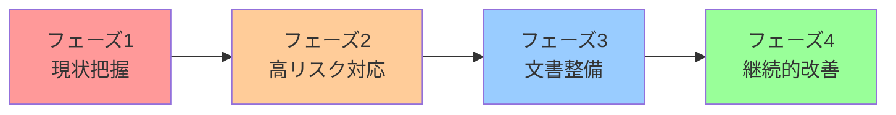

## はじめに：生成AIの規制が現実のものに

2024年8月、欧州連合（EU）が世界初の包括的なAI規制法「AI Act（人工知能規則）」を正式に施行しました。この法律は、ChatGPTやMidjourneyなど私たちが日常的に使う生成AIサービスにも大きな影響を及ぼします。

「自分は日本の企業だから関係ない」と思っている方、それは大きな誤解です。EUの一般データ保護規則（GDPR）が世界中の企業に影響を与えたように、**EU AI Actも日本企業にとって無視できない規制**となります。

この記事では、以下の内容をお届けします：

- EU AI Actの核心的な規制内容
- 日本企業への具体的な影響範囲
- 今すぐ始めるべき対応策
- 日本国内の規制動向との比較

**想定読者**：AI技術を活用する企業の開発者、プロダクトマネージャー、法務・コンプライアンス担当者

## EU AI Actとは何か：リスクベースアプローチの全体像

### 4段階のリスク分類

EU AI Actは、AIシステムを**リスクレベルに応じて4つのカテゴリ**に分類します。

1. **禁止されるAI（Unacceptable Risk）**
   - 社会信用スコアシステム
   - リアルタイム生体認証による大規模監視
   - サブリミナル操作技術

2. **高リスクAI（High Risk）**
   - 医療診断支援システム
   - 採用選考AI
   - 金融の信用評価システム
   - 重要インフラの管理システム

3. **限定的リスクAI（Limited Risk）**
   - チャットボット
   - ディープフェイク生成ツール
   - 感情認識システム

4. **最小リスクAI（Minimal Risk）**
   - スパムフィルター
   - ゲームのAI
   - その他大部分のAIアプリケーション

### 生成AIに対する特別規定

特に注目すべきは、**ChatGPTやGeminiなどの基盤モデル（Foundation Models）に対する規制**です。

以下の義務が課されます：

- **透明性報告書の作成・公開**
- 学習データの著作権遵守証明
- 生成コンテンツへの「AI生成」表示義務
- EU内でのサービス提供前の適合性評価

```yaml
# 基盤モデル提供者の主な義務
透明性:
  - モデルの能力と制限に関する文書化
  - 学習データの詳細情報開示
  - エネルギー消費量の報告

著作権:
  - 学習データの出所明示
  - 著作権保護された素材の使用ポリシー
  - オプトアウト機構の提供

安全性:
  - リスク評価の実施
  - セキュリティ対策の文書化
  - インシデント報告体制の構築
```

## 日本企業への具体的影響：3つのシナリオ

### シナリオ1：EU市場でAIサービスを提供している場合

**該当例**：
- EUユーザー向けにSaaSを提供するスタートアップ
- 欧州拠点を持つ日系企業の業務システム

**必要な対応**：
✅ AI Actの適合性評価を受ける
✅ EU代表者の任命（EU域内に拠点がない場合）
✅ 技術文書の準備（英語または現地語）
✅ リスク管理システムの構築

**罰則**：
違反時の制裁金は最大で**全世界売上高の7%または3,500万ユーロ**のいずれか高い方

### シナリオ2：海外製AIツールを業務で利用している場合

**該当例**：
- ChatGPT Enterprise for business
- GitHub Copilot for Business
- Adobe Firefly

**想定される変化**：
- サービス提供者が日本向けサービスの仕様変更
- 価格改定（コンプライアンスコスト転嫁）
- 一部機能の利用制限

**推奨アクション**：
```markdown
1. 現在使用中のAIツールのリスト化
2. 各ツールのEU AI Act対応状況の確認
3. 代替サービスの調査（リスク分散）
4. 社内ガイドラインの更新
```

### シナリオ3：独自AIモデルを開発している場合

**該当例**：
- 社内向けLLMの開発
- 顧客データを使った予測モデル
- 画像生成AIの研究開発

**重要ポイント**：
将来的にEU展開する可能性がある場合、**設計段階からAI Act準拠を考慮**すべきです。

後から対応するより、初期段階で以下を実装する方がコスト効率的です：

- データガバナンスフレームワーク
- モデルの説明可能性機能
- バイアス検出・軽減メカニズム
- 監査ログの記録

## 今すぐ始めるべき5つの対応策

### 1. AIインベントリの作成

まず自社で使用・開発しているAIシステムの全体像を把握しましょう。

```markdown
## AIインベントリテンプレート

| システム名 | 用途 | リスク分類 | 提供者 | EU展開有無 | 対応状況 |
|----------|------|----------|--------|-----------|---------|
| ChatGPT Enterprise | カスタマーサポート | 限定的 | OpenAI | - | 調査中 |
| 採用スクリーニングAI | 書類選考 | 高リスク | 自社開発 | 無 | 対応不要 |
| レコメンドエンジン | ECサイト | 最小 | AWS | - | 対応不要 |
```

### 2. データガバナンス体制の強化

EU AI Actは、学習データの品質と合法性に厳しい要件を課します。

**実装すべき項目**：
- データの出所追跡システム
- 著作権確認プロセス
- 個人情報の適切な匿名化
- データ保持期間ポリシー

### 3. 透明性確保のための文書化

技術文書は規制対応の要です。以下のドキュメントを整備しましょう。

```markdown
# 必須ドキュメント一覧

## システム設計書
- アーキテクチャ図
- データフロー図
- 使用している技術スタック

## リスク評価書
- 想定されるリスクシナリオ
- 軽減策
- 残存リスク

## 運用マニュアル
- モニタリング手順
- インシデント対応フロー
- 定期レビュープロセス

## テスト記録
- バイアステスト結果
- セキュリティテスト
- パフォーマンステスト
```

### 4. 人的リソースの確保

AI規制対応には複数の専門性が必要です。

**推奨体制**：
- **AI倫理責任者**：全体的なガバナンス
- **データ保護責任者（DPO）**：プライバシー対応（GDPR経験者が望ましい）
- **技術文書担当者**：エンジニアと法務の橋渡し
- **外部専門家**：EU法専門の弁護士

### 5. 段階的な対応ロードマップの策定

一度にすべてに対応するのは現実的ではありません。優先順位をつけましょう。



**フェーズ1（1-2ヶ月）**：AIインベントリ作成、リスク分類
**フェーズ2（3-6ヶ月）**：高リスクAIの対応策実装
**フェーズ3（6-12ヶ月）**：文書化、プロセス整備
**フェーズ4（継続）**：定期監査、アップデート

## 日本国内の規制動向：AI事業者ガイドラインとの関係

### 総務省・経産省のガイドライン

日本でも2024年4月に「AI事業者ガイドライン」が公表されました。

**EU AI Actとの主な違い**：

| 項目 | EU AI Act | 日本ガイドライン |
|-----|----------|--------------|
| 法的拘束力 | ✅ 法律 | ❌ 任意 |
| 罰則 | 最大売上高7% | なし |
| 適用範囲 | EU市場への提供者 | 日本のAI事業者 |
| 焦点 | リスク管理 | 倫理・信頼性 |

### 今後の展望

日本政府も法制化を検討中です。**EU AI Actへの対応が日本の規制にも役立つ**可能性が高いため、先行投資として考えることができます。

特に以下の分野では、国際的な基準が確立されつつあります：

- 生成AIの透明性表示
- 著作権保護の考え方
- バイアス対策の方法論
- リスク評価フレームワーク

## 実践的なチェックリスト

最後に、明日から使える実務チェックリストを提供します。

### 経営層向け

- [ ] AI戦略とコンプライアンスの整合性確認
- [ ] 必要予算の確保（法務費用、システム改修費用）
- [ ] 責任者の任命
- [ ] 取締役会での定期報告体制の構築

### 開発チーム向け

- [ ] 使用している外部AIサービスのライセンス確認
- [ ] モデル学習時のデータ出所記録の開始
- [ ] ログ収集・保存システムの実装
- [ ] バイアステストの自動化検討

### 法務・コンプライアンス向け

- [ ] EU AI Actの全文レビュー
- [ ] 既存契約書のAI条項追加検討
- [ ] プライバシーポリシーの更新
- [ ] 社内研修プログラムの企画

### プロダクトマネージャー向け

- [ ] 機能のリスク分類
- [ ] ユーザー向け透明性表示の設計
- [ ] オプトアウト機能の検討
- [ ] リリース前チェックリストへの追加

## まとめ：規制を機会に変える

EU AI Actは一見、ビジネスの足かせに見えるかもしれません。しかし、**適切に対応することで競争優位性に変えることができます**。

### 3つの重要ポイント

1. **グローバル展開の準備**
   - EU基準は事実上の世界標準になりつつある
   - 早期対応が将来の市場拡大を容易にする

2. **信頼の獲得**
   - 透明性と説明責任は顧客信頼につながる
   - コンプライアンスは差別化要因になる

3. **リスクの最小化**
   - 事後対応より事前対応がコスト効率的
   - 法的リスクの早期発見・対処

### 次のステップ

まずは小さく始めましょう：

1. 来週中にAIインベントリの作成を開始
2. 今月中に社内勉強会を開催
3. 来月までに外部専門家との相談機会を設定

AI規制の波は止められませんが、**準備している企業とそうでない企業では、数年後の競争力に大きな差**が生まれます。

今日から一歩ずつ、AI時代のコンプライアンス体制を整えていきましょう。

---

**参考リンク**：
- [EU AI Act 公式テキスト（英語）](https://eur-lex.europa.eu/)
- [総務省 AI事業者ガイドライン](https://www.soumu.go.jp/)
- [個人情報保護委員会 生成AIに関する資料](https://www.ppc.go.jp/)

**免責事項**：本記事は一般的な情報提供を目的としており、法律的助言ではありません。具体的な対応については専門家にご相談ください。